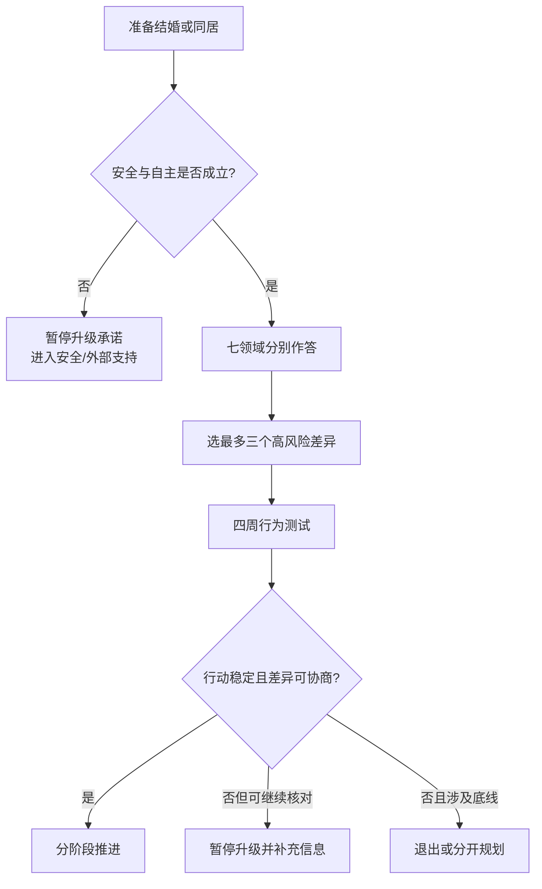

# 婚前与同居前决策审计

## Evidence base

This is a composite decision tool built from Hawkins et al. (2008), DOI 10.1037/a0012584, on structured relationship education; Olson et al. (2023), DOI 10.1093/jcr/ucad020, on shared-account structure; Newkirk et al. (2017), DOI 10.1007/s11199-016-0604-3, on household and childcare labor; Le et al. (2010), DOI 10.1111/j.1475-6811.2010.01285.x, on dissolution predictors; and Grace & Anderson (2018), DOI 10.1177/1524838016663935, on reproductive coercion. These sources support checking observable compatibility and autonomy. They do not calculate an individual's divorce probability.

## Hard gate: safety and autonomy

Do not escalate to marriage, cohabitation, pregnancy, joint debt, or shared property while any of the following remains active:

- violence, threats, stalking, sexual or reproductive coercion, or retaliation for refusal;
- one person controls the other's phone, documents, movement, healthcare, money, housing, or immigration status;
- important facts about debt, children, health, fidelity, legal status, or living arrangements are being concealed;
- one person cannot say “no” or leave a discussion without punishment.

Use a private device and outside support when discussing safety. Joint premarital counseling is not the first step when private disclosure may increase danger.

## Seven-domain audit

Each person answers separately first, then compare the written answers. For every domain, record **agreement, unresolved difference, experiment, and deadline**.

| Domain | Questions to answer | Minimum evidence before escalation |
|---|---|---|
| Commitment and exit | Are we both choosing marriage/cohabitation, or mainly avoiding age, family pressure, loneliness, or sunk cost? | Both can state a voluntary yes and a respectful exit route |
| Money | Income, debt, savings, support to parents, accounts, large purchases, and what remains separate? | Full disclosure and a written budget tested for one month |
| Labor | Who cooks, cleans, shops, manages appointments, handles night care and invisible planning? | A task list with primary owners, backup, and review date |
| Children and fertility | Whether, when, how many, fertility care, adoption, abortion, and contraception? | No “after marriage you will change” assumption; each person has veto over their body |
| Family boundaries | Visits, holidays, financial support, private information, childcare, and who makes final decisions? | A written boundary script and a plan for predictable conflicts |
| Conflict and repair | What happens when angry, hurt, or wrong? Can either person pause and return? | One observed repair cycle with changed behavior, not just promises |
| Lifestyle and future | Location, work, religion, sex, health, social life, pets, aging parents, and privacy? | Differences are either workable by a concrete plan or acknowledged as incompatibility |

## Four-week test before a major commitment

1. Choose no more than three high-impact unresolved domains.
2. Write one observable behavior for each, such as “both disclose all debt by Friday” or “alternate cooking and cleanup for four weeks.”
3. Set a weekly 30-minute review. Each person reports completed actions, missed actions, and the next adjustment.
4. Do not add a baby, large transfer, joint loan, or irreversible property commitment during the test merely to create pressure.
5. At the end, choose one of three decisions:
   - **Proceed in stages:** the issue is workable and both people consistently act;
   - **Pause escalation:** affection exists but facts, skills, or agreement remain unclear;
   - **Exit or separate plans:** a non-negotiable conflict, deception, coercion, or repeated refusal to act remains.

Suggested opening:

> 我们先不靠“结婚后自然会好”做决定。接下来四周只验证三个问题：___、___、___。每个问题写清事实、动作和日期。到___日，我们根据行动决定推进、暂停，还是分开规划。

## Reaction branches

| 对方反应 | 当下回答 | 下一步 |
|---|---|---|
| “你列这些就是不信任我” | “我愿意接受同样的核对。透明是双方规则，不是针对你。” | 双方同时书面回答，避免单方面审查 |
| “结婚后再谈” | “这些会直接决定共同生活成本。没有基本答案，我不会增加不可逆承诺。” | 暂停领证、同居、共同借贷或备孕 |
| 只给态度不给数据 | “态度重要，但我们还需要可核对的债务、时间、任务和边界信息。” | 设具体资料清单和截止日 |
| 愿意尝试但经常忘记 | “我们把任务缩小，并增加提醒或外部协助；如果仍不做，就按结果判断。” | 一周一次复盘，不无限降低标准 |
| 要求你先投入再证明 | “重大投入不能用来换取基本透明和安全。” | 保持财务、住房和生育自主权 |
| 明确不接受某个核心目标 | “这不是谁说服谁的问题。我们记录差异，再决定是否继续关系。” | 不用婚姻、怀孕或财务绑定来赌对方改变 |

## 停止条件 / Stop conditions

- 对方拒绝披露会影响共同生活的重大事实，却要求你先承担承诺；
- 把婚姻、同居、怀孕或金钱投入当作改变你的工具；
- 核心议题只能靠“以后再说”无限拖延；
- 四周测试中持续只有口头承诺，没有可观察行动；
- 任何胁迫、暴力、报复、跟踪或无法自由退出的情形。

