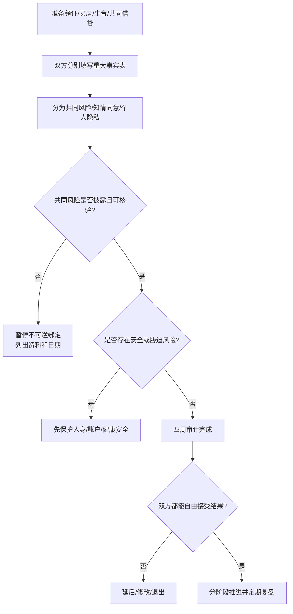

# 婚前重大事实披露与核验

## 明确结论

在领证、共同借贷、买房、生育或合并主要财务前，必须让双方知道会改变自己选择的重大事实，并给对方真实的考虑时间。披露不等于交出全部隐私，也不等于私自调查对方；重点是共同风险、知情同意和现实责任是否可核对。

## Evidence base

Slepian（2024，DOI 10.1177/09637214241226676）综述了秘密、隐瞒、心理负担、关系质量和披露后的影响。指南把它转化为三类信息和四周婚前审计；四周不是研究阈值，而是防止在压力下仓促绑定的决策期限。

现有相关来源还包括：

- Sharabi 与 Caughlin（2019，DOI 10.1177/1461444818792425）：线上资料真实性和现实核验；
- Garbinsky 等（2020，DOI 10.1093/jcr/ucz052）：共同财务中的隐瞒与欺骗；
- Grace 与 Anderson（2018，DOI 10.1177/1524838016663935）：生育自主与生殖胁迫；
- Cochrane STI review（2012，DOI 10.1002/14651858.CD002843.pub2）：性传播感染伴侣通知。

## 三类信息

### A. 共同风险：必须在绑定前披露并核验

这些信息会直接影响共同生活、债务、法律责任或安全：

- 婚姻登记状态、离婚是否完成、已有子女和抚养责任；
- 重大债务、担保、失信或会进入共同预算的长期义务；
- 住房产权、抵押、共有人的权利和实际居住限制；
- 成瘾、暴力、跟踪、性胁迫或会影响共同安全的持续行为；
- 重大传染病和性健康风险，以及需要共同决定的生育健康信息；
- 是否已有其他稳定伴侣、未结束的同居或持续的暧昧承诺；
- 生育意愿、不能接受的生育安排和重大迁移/照护责任。

### B. 知情同意相关事实：在决定前说明

- 婚礼、彩礼、购房、装修和父母援助的真实预算；
- 工作城市、户籍迁移、职业变动和照护父母的计划；
- 对忠诚、性边界、共同账户、个人账户和隐私的定义；
- 既往婚姻经历中仍会影响当前关系的责任或安排；
- 重大健康状况如何影响工作、照护、保险和生育计划。

### C. 个人隐私：不因“透明”自动交出

- 与共同责任无关的普通消费细节；
- 个人日记、朋友的秘密和与关系无关的聊天；
- 不影响共同生活的过去经历细节；
- 手机密码、定位、全部社交账号和私密影像。

隐私边界不是隐藏共同风险的许可证；共同风险也不是全面监控的许可证。

## 四周婚前审计

### 第 1 周：分别填写事实表

双方各自填写，不先看对方答案：

| 类别 | 至少写清 |
|---|---|
| 婚史与子女 | 登记/离婚状态、子女、抚养费和探视责任 |
| 财务 | 税前/到手收入、债务、担保、固定支出、父母援助 |
| 住房 | 产权人、贷款、共有安排、城市和居住限制 |
| 健康与性 | 影响共同生活的健康情况、检测、避孕和生育信息 |
| 家庭 | 父母养老、兄弟姐妹责任、彩礼和婚礼预期 |
| 未来 | 城市、职业、婚育、照护和时间表 |
| 安全 | 暴力、威胁、成瘾、控制和危险行为史 |

只写会影响共同决策的内容，避免把审计变成互相羞辱。

### 第 2 周：交换并逐项标注

每项标记为：

- 已披露且有材料；
- 已披露但需要核验；
- 双方理解不同；
- 一方拒绝说明；
- 信息不适用于共同决策。

不要在一次争吵中处理全部内容。优先处理会影响领证、借贷、住房、生育和安全的项目。

### 第 3 周：做有限核验

- 财务：共同债务、担保、贷款和重大固定支出，用本人主动提供的账单、合同或官方渠道核对；
- 婚史与子女：由本人说明登记状态、责任和可核验文件，必要时咨询婚姻登记或法律专业人士；
- 健康与性：由本人决定医疗隐私边界，涉及共同性健康时完成医生或检测机构建议；
- 住房：查看产权、抵押和共有安排，不接受“婚后再说”；
- 家庭责任：把金额、频率、期限和谁承担写进预算；
- 安全：出现暴力、威胁或成瘾风险时，不安排单独对质，优先安全支持。

### 第 4 周：分别作出决定

双方独立写下：

1. 继续推进；
2. 延后并列出补齐资料和日期；
3. 修改方案后再评估；
4. 停止领证、购房、生育或共同借贷计划。

没有完整信息时，默认选择“延后”，而不是用感情强行覆盖风险。

## 可直接使用的话术

> “我不是要求你交出全部隐私。我们要决定结婚、住房和未来责任，所以需要把会改变选择的事实说清楚，并给彼此时间考虑。”

> “请把婚史、子女、债务、住房、健康、生育和父母责任分别写下来。今天只核对事实，不先评价谁好谁坏。”

> “在债务和产权没有核对前，我不领证、不共同借贷、不支付不可退的大额款项。”

> “如果你现在不愿披露，我尊重你不说的权利，但我也会把它当成信息不足，暂不推进婚姻绑定。”

## 对方可能反应及回答

| 对方反应 | 回应 | 下一步 |
|---|---|---|
| “你不信任我。” | “信任不能替代共同风险信息。我们可以讨论核验范围，不需要全面监控。” | 回到三类信息 |
| “这是我的隐私，你无权问。” | “普通隐私我不要求；会影响共同债务、健康、婚育和安全的事实必须在承诺前知道。” | 区分 A/B/C 类 |
| “结婚后自然会解决。” | “结婚会增加绑定，不会自动解决事实、钱和责任。” | 暂停升级，设补齐日期 |
| “你爱我就应该接受我的债务。” | “爱和承担共同债务是两个决定。先确认金额、期限、责任和可行方案。” | 不共同借贷、不担保 |
| 对方愿意披露但没有材料 | “先列出未知项和获取日期，资料齐全前不做不可逆决定。” | 进入第 3 周有限核验 |
| 对方短期积极，随后继续隐瞒 | “短期配合不能替代完整事实和持续行为。” | 延后婚礼/领证，做关系审计 |
| 发现重大隐瞒后道歉 | “道歉是第一步，还需要事实、责任、补救和未来防复发安排。” | 72 小时暂停不可逆决定 |
| 对方威胁、暴力或控制 | “我不在不安全环境下继续谈。” | 离开、联系支持者和当地专业服务 |

## Stop conditions

- 隐瞒婚姻状态、子女、重大债务、担保、住房产权或性健康风险；
- 伪造材料、拒绝所有合理核验，却要求你先领证、借贷、买房或生育；
- 把彩礼、怀孕、家庭面子或年龄压力作为逼迫披露或绑定的工具；
- 暴力、跟踪、性胁迫、经济控制、成瘾后危险驾驶或危险照护；
- 披露后把责任归咎于你，拒绝停止风险行为或要求你替其承担；
- 在信息未完整前要求支付不可退大额款项或签署共同债务。

触发停止条件时，停止增加绑定，保留证件、账户、住处和健康支持；涉及法律、医疗、暴力或债务问题时咨询当地专业机构。

## Mermaid 分流图

## Evidence boundary

研究不能替你决定该不该结婚，也不能把一次隐瞒直接等同于某种人格。披露的最低范围取决于共同风险、法律义务、健康知情同意和双方约定；不同城市、家庭和关系形式需要调整清单。指南给的是“在信息不足时暂停绑定”的保守决策规则。

