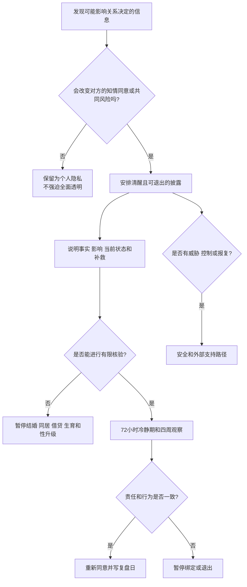

# 隐私、秘密与婚前重大事实披露

## 明确结论

不是所有私人信息都必须立即交出，但会改变对方是否同意恋爱升级、结婚、共同借贷、生育或性关系的事实，必须在决定前披露并允许对方重新选择。先把信息分成**共同风险、知情同意相关事实、个人隐私**三类，再决定披露范围、核验方式和时间。披露不等于交出密码，也不等于对方获得无限审问权。

## Evidence base

Slepian（2024，DOI 10.1177/09637214241226676）的叙述性综述区分秘密本身与主动隐瞒，讨论秘密的持续心理负担及披露后的关系结果。该综述不能直接给出每段关系的披露清单；下面的四周流程是结合婚前重大事实核验、性健康和关系安全要求形成的决策工具。

## 第一步：三类信息分类

| 类别 | 例子 | 处理方式 |
|---|---|---|
| 共同风险 | 婚姻状态、重大债务、传染病风险、共同子女、成瘾、法律限制、会影响共同资产的责任 | 在升级决定前主动披露，允许对方核验和拒绝 |
| 知情同意相关事实 | 生育意愿和限制、性边界、长期照护责任、计划迁移、职业和住房安排 | 在进入排他、同居、结婚、生育或共同财务前谈清 |
| 个人隐私 | 日记、朋友的秘密、与当前决策无关的旧聊天、个人兴趣和不影响共同风险的经历 | 可以保留；不因“透明”要求全面交出 |

判断问题只有一个：**如果对方事先知道，是否可能改变其是否继续或如何继续的选择？** 如果答案是“可能”，不要把它包装成无关隐私。

## 第二步：四周披露与核验流程

### 第 1 周：列清单

双方各自写出可能影响共同决定的信息，标记“已告知、待告知、待核验、仅个人隐私”。只写事实和影响，不写羞辱性细节。涉及医疗、征信或法律事项时，记录应咨询的专业机构。

### 第 2 周：安排披露

选择清醒、私密且双方可以离开的时间。一次只处理一个主题，先说事实、时间、当前状态和已采取措施，再说对共同计划的影响。不要在争吵、性行为前后、醉酒或对方无法安全拒绝时披露。

可直接使用：

> “有一项会影响你是否愿意和我结婚的事实。我先说明事实和现在的风险，你可以暂停、提问或决定不继续，不需要当场回答。”

> “这是我的个人隐私，不影响你的健康、财务或同意。我愿意说明它与当前决定无关，但不会交出全部设备和账号。”

### 第 3 周：有限核验

核验与决定直接相关的部分：婚姻登记状态、债务和资产、检测结果、共同子女或照护责任、合同和法律限制。核验目的不是搜查，而是让双方依据同一事实决策。使用正规机构、书面记录或双方共同认可的证明，不要求密码和无关聊天记录。

### 第 4 周：重新选择

披露后至少留出 72 小时，不催促对方原谅、结婚、发生性关系或继续共同借贷。双方分别回答：事实是否清楚、风险是否可接受、对方是否承担责任、我是否仍自愿继续。未完成核验前，暂停不可逆绑定。

## 对方可能反应及对应回答

| 反应 | 回应 | 下一步 |
|---|---|---|
| 对方需要时间 | “你不必现在决定。我会在___日提供核验材料，之后由你选择。” | 保持 72 小时冷静期 |
| 对方提出与风险无关的全面搜查 | “我愿意核验这项共同风险，但不会交出所有密码和私人记录。” | 限定范围和截止日 |
| 对方说“既然爱我就应该马上原谅” | “原谅和继续绑定是两个决定。我们先处理事实、风险和责任。” | 暂停升级，完成核验 |
| 对方否认事实或改口 | “我们先以可核对材料为准，不在争吵中互相定性。” | 保存记录，咨询专业机构 |
| 对方愿意承担责任并接受边界 | “我们把补救动作、负责人、日期和复盘日写下来。” | 进入短期修复观察 |
| 对方羞辱、威胁或公开隐私 | “我不会在威胁下继续披露或做决定。” | 结束谈话，进入安全路径 |
| 你发现对方隐瞒会改变你的选择的事实 | “这改变了我的知情同意。我先暂停升级，核对范围后再决定。” | 处理健康、财务和居住风险 |

## Stop conditions

- 隐瞒婚姻状态、重大债务、性健康风险、共同子女或会影响共同资产的法律责任；
- 以自伤、分手、曝光隐私、性或经济报复逼迫对方立即原谅或继续绑定；
- 以“透明”为名强迫交出密码、定位、设备、朋友秘密或全部聊天记录；
- 披露后继续篡改事实、销毁证据、拒绝合理核验或把责任归咎于提问者；
- 任何跟踪、暴力、性胁迫、经济控制或无法安全拒绝。

触发停止条件时，不单独对质或继续婚前实验；先保护证件、账户、健康和住处，并联系可信支持、医疗、法律或当地安全服务。

## Mermaid 分流图

## Evidence boundary

研究支持对秘密负担和披露过程的关注，但不能据此判断某个具体人必然不忠或某次未披露必然导致关系失败。本指南的分类、72 小时冷静期和四周观察是降低重大决策误差的实用规则，不是研究直接验证的治疗标准。

