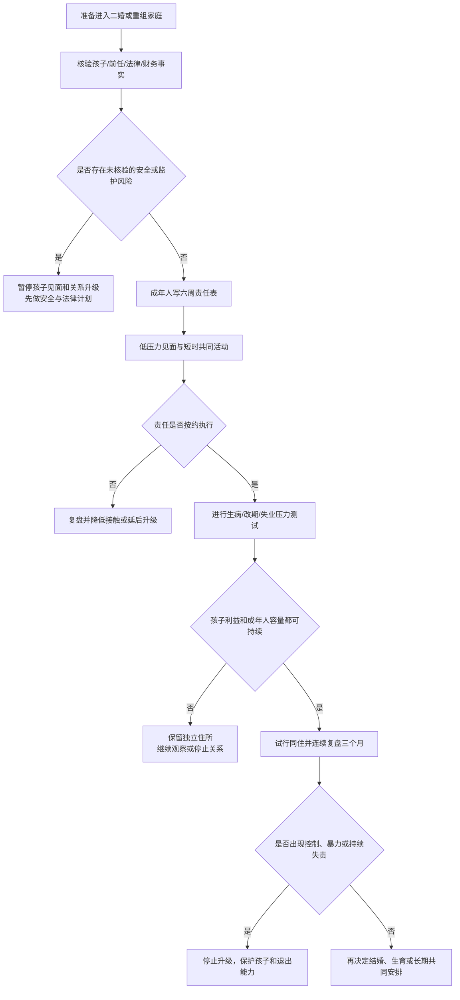

# 二婚、继亲与重组家庭审计

重组家庭的核心问题不是“孩子能不能接受新伴侣”，而是成年人能否在孩子利益、前任协作、财务责任和新关系边界之间建立稳定的规则。先把事实和责任写清，再决定同居、结婚或生育，不用一次仪式掩盖长期协调成本。

## Evidence base

共同育儿质量与婚姻满意度在群体研究中相关（Ronaghan et al., 2024，DOI 10.1037/fam0001149）；关系满意度会随人生阶段和压力变化（Bühler et al., 2021，DOI 10.1037/bul0000342）。这些结果支持持续协调和阶段性复盘，但不能预测某个孩子或家庭一定会成功或失败。

本指南默认适用于二婚、未婚同居、同性伴侣、继亲和共同育儿家庭。抚养权、探视、继承、收养和跨境迁移需要另行核对当地法律文件。

## 进入关系前必须核验的事实

双方单独填写，再交换原始信息：

| 领域 | 必须核验 |
|---|---|
| 孩子 | 年龄、健康、教育、日常照护人、特殊需要、孩子是否知情 |
| 前任 | 婚姻/分手状态、抚养或探视安排、沟通渠道、冲突和安全风险 |
| 法律 | 监护、抚养费、探视、收养、迁移和紧急医疗授权文件 |
| 财务 | 抚养费、教育费、债务、保险、住房和大额支出上限 |
| 居住 | 谁同住、孩子房间、接送路线、与祖父母同住和搬迁计划 |
| 角色 | 新伴侣在何时承担照护、纪律、接送和医疗决定，谁拥有最终权限 |
| 新关系 | 是否结婚、是否生育共同孩子、时间表以及任何一方可否暂停升级 |

任何一项只能得到“以后再说”，都标记为未核验，不把它当成默认同意。

## 六周渐进方案

### 第 1 周：成年人对齐

只由成年人讨论前任、孩子、财务和安全事实。确认是否存在家暴、跟踪、成瘾、严重失信、未解决的监护争议。若有安全风险，先做安全计划，不安排孩子见面。

### 第 2 周：建立书面责任表

写出工作日、周末、假期、接送、作业、就医、费用和临时替班。每项标明主责人、备用人、通知时限和费用上限。不要只写“共同照顾”。

### 第 3 周：低压力见面

选择 60—90 分钟、可随时离开的公共活动。新伴侣先做可靠的成年人，不急于叫“爸爸/妈妈”、送贵重礼物或执行纪律。活动后分别询问孩子感受，不要求孩子表态支持婚姻。

### 第 4 周：短时共同活动

进行 2—4 次短时活动，观察接送、迟到、规则和冲突处理。新伴侣只承担事先约定的小任务，亲生父母负责主要纪律和与前任沟通。

### 第 5 周：压力测试

模拟生病、考试、加班、前任临时改期、孩子拒绝见面和一方失业。记录谁发现问题、谁决策、谁付款、谁承担后果。若每次都由一人兜底，暂停同居或结婚计划。

### 第 6 周：阶段决定

只选一个结果：继续维持约会；继续见面但不共同居住；试行短期同住并保留独立住所；延后婚姻；停止关系。孩子的短期顺从不等于长期适应，至少连续复盘三个月再升级不可逆安排。

## 角色边界

- 亲生父母对孩子的法定和核心养育责任不能自动转给继亲；
- 继亲可以执行共同约定的日常规则，但重大医疗、学校、迁移和惩罚决定需由有权限的成年人作出；
- 前任沟通围绕孩子和必要事务，使用可留痕的单一渠道；不让孩子传话、打听或站队；
- 新伴侣之间的共同账户、住房和共同孩子计划与前段关系的抚养费、债务、保险分开核算；
- 任何孩子都有拒绝身体接触、称呼和单独相处的权利，成年人负责提供替代安排。

## 可直接使用的话术

> “我愿意逐步进入你的家庭，但不会在事实不清时接手抚养、付款或纪律责任。我们先把谁负责什么写下来。”

> “关于孩子的重大决定由有法律权限的父母做。我们可以讨论建议和日常配合，但不让孩子替成年人传话。”

> “我不会要求孩子马上接受我，也不会用礼物或称呼换取亲近。我们先安排短时间、低压力的见面。”

> “前任沟通只围绕孩子和必要事务，使用共同认可的渠道。超出范围的争议由成年人直接处理。”

## 对方可能的反应及回应

| 反应 | 回应 | 下一步 |
|---|---|---|
| “孩子以后自然会接受你。” | “接受需要时间和稳定行为，不能拿婚期倒逼。” | 回到六周渐进安排 |
| “你既然要结婚，就应该马上管教孩子。” | “我可以承担事先约定的日常任务，核心纪律和重大决定先由亲生父母负责。” | 写责任表，拒绝临时加责 |
| “不要问前任的事，过去都结束了。” | “前任安排会直接影响接送、费用和安全，是共同生活的现实信息。” | 信息不完整则不升级同居 |
| “孩子不喜欢你，是你不够努力。” | “孩子可以有复杂感受，我们观察具体事件，不要求站队。” | 暂停对质，分别听取孩子和成年人 |
| 前任频繁临时改期 | “我们需要固定渠道、通知时限和替班方案。” | 连续记录四周；无改善则调整探视和居住 |
| 对方要求你承担全部费用 | “抚养责任、共同生活支出和自愿支持要分开列账。” | 设月度上限，不共同借贷 |
| 伴侣要求你与孩子立刻同住 | “同住是不可逆成本，先完成六周试行和压力测试。” | 保留独立住所，延后决定 |
| 出现羞辱、威胁或让孩子传递冲突 | “我们先停止这次安排，安全和边界恢复后再谈。” | 保存记录，必要时寻求专业和法律支持 |

## Stop conditions

- 隐瞒监护、抚养费、债务、前任冲突或安全风险；
- 要求新伴侣在无授权、无培训和无备用人的情况下承担全部照护；
- 把孩子当作传话人、证人、谈判筹码或要求其选择阵营；
- 以婚姻、住房、怀孕或经济支持逼迫孩子或新伴侣快速建立亲密；
- 前任或现任出现暴力、跟踪、威胁、报复、物质滥用或危险接送；
- 一方拒绝书面责任表，却要求先同住、共同借贷、领证或生育；
- 连续三个月所有临时风险都由同一人兜底，且对方拒绝调整。

触发停止条件时，不把孩子带入争执；暂停同住、共同借贷和生育升级，保留独立住所与账户。存在现实危险时先联系当地紧急服务、家暴支持或儿童保护机构。

## Mermaid 分流图

## Evidence boundary

共同育儿与关系满意度的研究是群体层面的相关证据，不能替代孩子的个别评估或法律判断。指南不假定继亲必须承担法定父母角色，也不把前任冲突自动解释为某一方有错。涉及监护、探视、收养、迁移、抚养费、继承和安全风险时，应核对当地现行法律并寻求合格专业支持。
