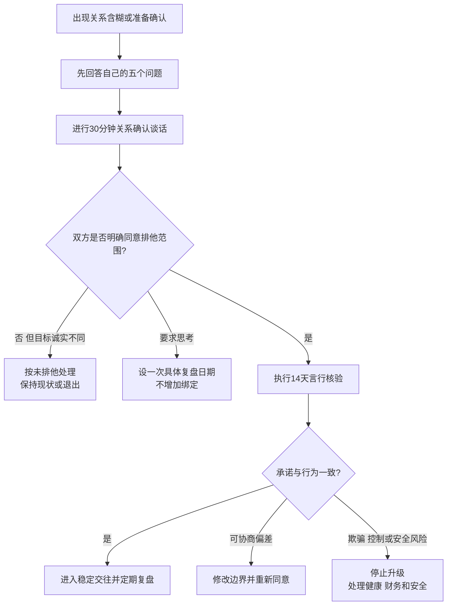

# 关系确认与排他边界

## 明确结论

不要靠聊天频率、发生性关系、见过朋友或默认称呼来猜是否已经确定关系。先弄清自己要什么，再和对方逐项确认关系定义、排他范围和复盘时间；口头答案必须由后续行为支持。若对方长期享受伴侣待遇却拒绝给出最低限度的清晰边界，把它视为当前不愿承诺，而不是等待你继续证明自己。

## Evidence base

Knobloch 与 Solomon（1999，DOI 10.1080/10510979909388499）将关系不确定性分为自我、伴侣和关系三个来源，并识别愿望、评价和目标等内容。以下流程将这个测量框架转化为现实决策步骤；研究本身没有证明本流程必然提升关系质量。

## 第一步：先回答自己的五个问题

在谈话前独立写下答案，避免只逼对方定义：

1. 我是否希望与此人建立排他关系，还是仍在观察？
2. 我所说的“排他”是否包括停止认识新对象、停止约会软件配对、停止接吻和性行为？
3. 我能接受哪些异性/同性朋友、前任、暧昧对象和社交媒体互动？
4. 性健康需要怎样安排：安全套、检测、结果披露和其他性伴侣告知？
5. 若对方不愿确认，我最多继续当前状态多久，届时采取什么行动？

这一步处理**自我不确定性**。没有自己的答案，就容易把焦虑包装成“让对方给安全感”。

## 第二步：进行一次 30 分钟确认谈话

在平静、清醒、可自由离开的环境中直接说：

> “我希望确认我们现在的关系，而不是靠猜。我想进入排他关系。对我来说，这包括停止和别人约会或发生亲密行为、暂停约会软件，并在边界变化前先告诉彼此。你现在是否也愿意？”

随后逐项确认：

- 当前称谓：认识中、约会中、排他交往、伴侣，还是其他；
- 排他行为：约会、接吻、性行为、裸聊、约会软件、与前任互动；
- 公开范围：朋友、家人、社交平台是否公开，暂不公开的具体原因；
- 时间和投入：见面频率、联系预期、异地与工作高峰如何处理；
- 性健康：检测、安全措施、风险变化的告知；
- 未来节点：14 天观察后复盘，还是明确不进入关系。

这一步核验**伴侣不确定性**和**关系不确定性**。只记录明确答案，不替对方补充“他可能只是害怕”。

## 第三步：做 14 天言行核验

确认关系后，用 14 天观察基本一致性：

1. 双方完成约定动作，例如停用约会软件、告知仍在联系的暧昧对象或预约检测；
2. 记录失约事实，不查手机、不套话、不要求实时定位；
3. 第 7 天只处理执行障碍，不重谈所有条款；
4. 第 14 天各自回答：边界是否清楚、执行是否一致、是否愿意继续；
5. 若要修改边界，修改前重新取得双方同意，不能事后单方面改定义。

观察期不是忠诚考验。对方无需交出密码、聊天记录或全部隐私；你需要判断的是其公开承诺与可观察行为是否一致。

## 常见反应与相应回答

| 对方反应 | 你的回答 | 实际动作 |
|---|---|---|
| “顺其自然，没必要定义。” | “可以不进入排他关系，但我不会把未定义状态当成伴侣关系。” | 决定继续非排他约会或退出 |
| “我只和你联系，但不想承诺。” | “我按你现在不愿承诺来决策，不把事实排他等同于关系承诺。” | 不升级性、财务、住房和家庭绑定 |
| “删软件就是控制我。” | “你可以保留使用自由，我也可以不接受在排他关系中继续使用。” | 判断边界是否兼容，不强迫删号 |
| “发生关系了当然算男女朋友。” | “性行为不自动等于排他或承诺，我们需要明确同意。” | 先确认性健康和关系定义 |
| “公开关系会影响工作或家里。” | “我可以讨论暂缓公开，但需要具体原因、范围和复盘日期。” | 写明谁暂不知情以及何时复盘 |
| “你这样问说明你不信任我。” | “清晰边界是建立信任的条件。我们可以不同意，但不能用猜测代替。” | 回到逐项问题 |
| 对方口头同意，却继续约会或隐瞒 | “这与我们确认的边界不一致。我停止关系升级，并按违约处理。” | 暂停亲密接触，完成健康风险处理并决定退出 |
| 对方说“以后再说” | “可以，请给出具体日期。在此之前我按未排他处理。” | 设一次复盘日期，不无限延期 |

## 决策规则

- **双方明确同意且行为一致**：进入稳定交往，按约定日期复盘。
- **目标不同但双方诚实**：承认不兼容，保持非排他关系或结束，不试图改造对方。
- **一方需要短期思考**：只给一次明确期限；期限内不增加性、金钱、住房或家庭绑定。
- **持续含糊且享受伴侣待遇**：按“不愿提供你需要的关系”处理，收回超出当前关系的投入。
- **边界被违反**：先处理性健康、住房、金钱和安全，再决定是否进入背叛修复流程。

## Stop conditions

- 用威胁分手、自伤、曝光、怀孕、生育压力或经济手段逼迫对方确认关系；
- 强迫交出手机、密码、定位、私密影像或全部社交记录；
- 隐瞒其他性伴侣、性传播感染风险、婚姻状态或已有稳定伴侣；
- 多次答应排他又秘密约会，并把核实事实说成“你太敏感”；
- 因提出边界而遭遇羞辱、跟踪、性胁迫、暴力或报复。

出现安全风险时，不安排单独对质；优先保留证件、账户、住处、健康检查和可信支持者。

## Mermaid 分流图

## Evidence boundary

本指南不能根据一次犹豫判断对方“不爱”“回避型”或一定会背叛。它只把三类不确定性变成可回答的问题，并用有限时间内的行为帮助个人作出选择。排他形式没有唯一正确答案；有效边界需要知情、自愿、对等，并允许任何一方拒绝和退出。
