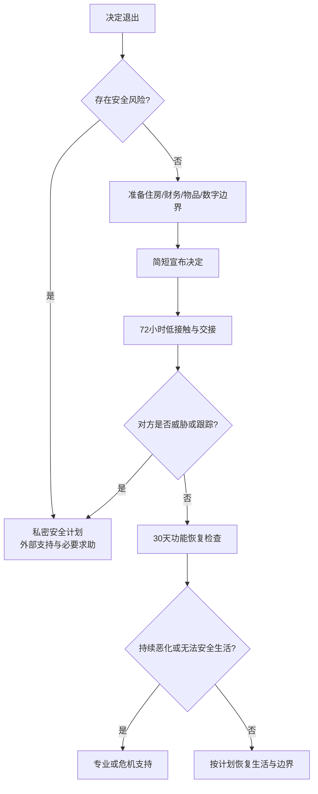

# Relationship exit execution

## Evidence base

Verhallen et al. (2019), DOI 10.1371/journal.pone.0217320, found elevated depression symptoms after recent breakups and links with sudden loss and reduced positive affect. Le et al. (2010), DOI 10.1111/j.1475-6811.2010.01285.x, identified commitment, love, inclusion, and dependence as group-level dissolution predictors. These findings support an exit plan that handles both logistics and post-breakup functioning; they do not prescribe a single “correct” way to end a relationship.

## Before announcing the breakup

1. Decide whether the decision is final, a time-limited separation, or a request to renegotiate. Do not present a final decision as a debate if you have already decided.
2. Check immediate safety: violence, threats, stalking, weapon access, financial dependence, housing, immigration documents, or risk to children. If risk exists, use a private device, tell a trusted person, prepare a place to go, and do not meet alone merely for “closure.”
3. Secure essentials: identification, medication, keys, money, devices, passwords, important records, and a safe way to travel.
4. List shared items and obligations: lease, deposits, debt, subscriptions, pets, children, accounts, and digital access. Separate passwords and two-factor authentication without deleting evidence or shared legal records.

## The announcement

Use a short statement with no invitation to negotiate the decision:

> 我决定结束这段关系。这个决定不是今天争论后再投票的事项。我们只需要在安全和尊重的前提下处理住房、财务、物品和联系方式。我会在___时间用书面方式确认安排。

If a face-to-face conversation is unsafe, use a written message, a public place with an exit, or a third party. A detailed explanation is optional; safety and clarity come first.

## First 72 hours

- Tell one trusted person what happened and agree on a check-in time.
- Change passwords, review location sharing and device sessions, and mute or block contact channels as needed.
- Keep communication to one written channel for logistics; do not use late-night arguments to process the relationship.
- Arrange sleep, food, medication, work coverage, and transport. Treat inability to sleep, eat, work, or stay safe as information requiring support, not as evidence that the breakup was wrong.
- Do not make a rebound relationship, large purchase, substance use, or public accusation the immediate coping plan.

## Logistics table

| 事项 | 写清楚的内容 | 截止时间 |
|---|---|---|
| 住房 | 谁住到哪天、钥匙、押金、搬运、房东通知 | ___ |
| 财务 | 共同账户、借款、账单、订阅、转账凭证 | ___ |
| 物品 | 清单、取回方式、第三方交接、不可进入的空间 | ___ |
| 宠物/子女 | 临时照护、费用、交接、只讨论必要事项的渠道 | ___ |
| 数字边界 | 密码、定位、照片、社交媒体、设备和云端共享 | ___ |
| 联系规则 | 仅物流、频率、紧急例外、是否屏蔽 | ___ |

## Reaction branches

| 对方反应 | 当下回答 | 下一步 |
|---|---|---|
| “再给我一次机会” | “我听见你想挽回，但我的决定不改。我们现在只处理交接。” | 重复一次，不进入长时间辩论 |
| 哭泣或指责你冷酷 | “你难受我理解，但我不会用继续关系来消除当下情绪。” | 联系支持者，结束当次对话 |
| 威胁自伤 | “我会联系能提供即时帮助的人，但我不会以继续关系作为条件。” | 联系当地急救/危机服务和其可信任联系人；不要独自承担 |
| 威胁报复、曝光或跟踪 | “我不再私下谈判。后续只保留书面必要沟通。” | 保存证据，告知支持者，进入安全和法律路径 |
| 要求立即见面取物 | “我们按书面清单和___时间交接，可由第三方在场。” | 不在未准备时单独见面 |
| 反复发送消息 | “物流请发到___；其他消息我不回应。” | 静音/屏蔽并保存必要记录 |

## 30-day recovery check

每周记录四项：睡眠、饮食/药物、工作或学习功能、与可信任人的联系。若持续两周明显恶化、无法完成基本生活、出现持续绝望或自伤想法，尽快联系当地心理健康专业人员或危机服务；有即时危险时直接联系当地急救服务并让可信任的人陪同。

## Stop conditions

- 任何见面、通话或交接导致威胁、暴力、跟踪或报复升级；
- 对方把住房、金钱、孩子、宠物或隐私当作迫使复合的工具；
- 你因“解释清楚”持续暴露在高冲突或危险接触中；
- 出现无法保证自身安全、自伤想法或严重功能崩溃。

