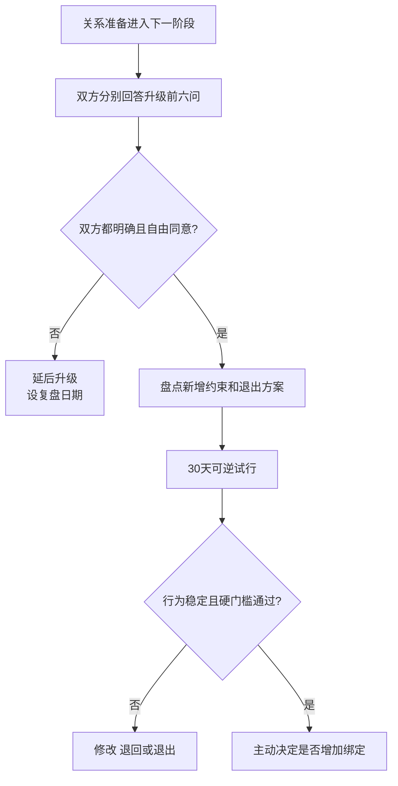

# 关系推进节奏与阶段决策

## Evidence base

Stanley、Rhoades 与 Markman（2006）的框架（DOI 10.1111/j.1741-3729.2006.00418.x）指出，同居和资源绑定会增加关系惯性。指南要求在每次退出成本上升前主动决定，避免因为便利、房租或家庭压力滑入下一阶段。

## 七个明确决策点

每到一个节点，双方都要能自由说“继续、延后或停止”：

1. 从聊天/约会转为排他关系；
2. 长期留宿或共享钥匙；
3. 同居或共同租约；
4. 共同养宠或承担照护；
5. 见父母、订婚或支付彩礼/婚礼款；
6. 共同借贷、购房或合并主要财务；
7. 领证、生育或迁移。

## 每次升级前的六问

1. 我们为什么现在升级，目标是什么？
2. 双方对忠诚、婚育、城市和时间表是否一致？
3. 新阶段增加哪些金钱、住房、身体、家庭和职业约束？
4. 家务、心理负荷和费用由谁完整负责？
5. 试行多久、何时复盘、什么情况退回上一阶段？
6. 如果分手，租约、宠物、财物、账户和住处怎么处理？

## 30 天可逆试行

1. 不立即签长期租约、借贷或转移大额资产，先模拟目标安排 30 天。
2. 按未来分工实际执行做饭、清洁、通勤、预算、私人空间和双方家庭联系。
3. 每周记录三件事：谁主动承担、哪些冲突重复、退出是否仍然可行。
4. 第 30 天各自独立写“继续、修改、延后、退出”，再共同讨论。
5. 只有双方明确选择继续，且硬门槛通过，才增加下一层绑定。

可直接使用的话术：

> “我愿意推进，但不想因为房租和方便自动同居。我们先把目标、分工、费用和退出方案写清楚，再试行 30 天。”

> “见父母和共同养宠都会增加退出成本。我们先确认这是双方主动选择，不是默认关系必须升级。”

## 反应分支

| 对方反应 | 回应 | 下一步 |
|---|---|---|
| “都在一起这么久了，当然该结婚。” | “时间增加投入，但结婚需要当前的主动决定和现实审计。” | 完成六问和婚前审计 |
| “同居只是省房租，不用谈那么多。” | “省房租也会带来租约、家务和退出成本。” | 30 天模拟并保留独立住处 |
| “不合并账户就是不信任。” | “信任不要求取消退出能力。共同支出可以透明，个人应急金保留。” | 分层财务结构 |
| 一方想升级，另一方犹豫 | “犹豫表示暂不满足共同同意。” | 设复盘日期，不施压 |
| 已经同居但从未明确未来 | “现在补做决定仍然有效。” | 分别填写继续/延后/退出方案 |
| 对方用分手、住房或钱逼迫升级 | “这不是共同决定，是约束和压力。” | 停止升级，保护住房和账户 |

## Stop conditions

- 在一方犹豫或拒绝时强迫排他、同居、订婚、领证、生育或共同借贷；
- 以房租、彩礼、宠物、共同财物或家庭面子阻止退出；
- 隐瞒婚史、债务、生育目标、住房产权或其他重大事实后要求升级；
- 一方失去独立账户、住处、证件、工作或安全退出能力；
- 出现威胁、暴力、跟踪、性胁迫或经济控制。

触发停止条件时，停止增加绑定，优先恢复独立住房、账户、证件和外部支持。

## Mermaid 分流图

