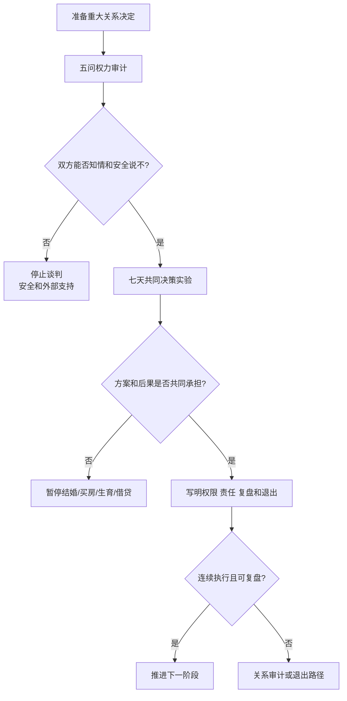

# 关系权力与重大决策审计

## Evidence base

Young 与 Seedall（2024）的综述（DOI 10.1111/famp.13008）指出，权力是伴侣施加或抵抗影响的互动模式。指南把权力差异落到具体决策和退出能力上，区分正常分工、谈判失衡与控制。

## 五问审计法

对每个重大决定（结婚、买房、迁移、生育、借贷、与父母同住）分别回答：

1. 谁提出方案，另一方是否有充分信息和时间考虑？
2. 谁拥有最终决定权，另一方能否真实说“不”？
3. 谁承担金钱、职业、身体和家庭后果？
4. 谁负责执行、提醒、修复和善后？
5. 如果方案失败，谁有住房、账户、证件和社会支持可以退出？

## 七天共同决策实验

1. 第 1 天各自写出目标、底线、可接受让步和不可逆成本。
2. 第 2–3 天交换信息：收入、债务、房产、家庭责任、健康、生育和迁移影响。
3. 第 4 天各自提出两个方案，不能只有一方提供选项。
4. 第 5 天用最坏情景测试：失业、疾病、怀孕、父母照护和关系结束。
5. 第 6–7 天写一页协议，标明共同同意、个人决定、否决条件、复盘日和退出路径。

可直接使用的话术：

> “这不是谁说服谁，而是要看谁能安全说不、谁承担后果、谁有退出路径。没有这些条件，我们不推进不可逆决定。”

> “收入和学历不同不自动意味着谁更有权。重大决定需要双方知情、可拒绝，并共同承担后果。”

## 反应分支

| 对方反应 | 回应 | 下一步 |
|---|---|---|
| “我赚得多，所以我决定。” | “贡献可以不同，但重大决定的知情权、拒绝权和安全不能按收入取消。” | 五问审计，明确权限 |
| “你不同意就是不支持我。” | “支持不等于放弃否决和退出能力。” | 要求提供第二方案 |
| “父母/房子/彩礼已经决定了。” | “外部压力不能替代我们的共同同意。” | 暂停签字、转账和绑定 |
| 对方愿意分享信息并调整方案 | “我们把让步、责任和复盘日期写下来。” | 执行七天实验 |
| 对方拒绝提供信息或威胁后果 | “没有知情和安全，就不做这个决定。” | 保护账户、证件和居住安全 |
| 一方无法安全说不 | “这已经不是普通协商。” | 停止共同谈判，进入安全支持 |

## Stop conditions

- 以收入、住房、彩礼、户籍、性别、学历或家庭资源强迫对方服从；
- 扣押证件、冻结账户、限制工作/社交/就医或阻止离开；
- 以分手、暴力、自伤、公开隐私或经济报复逼迫结婚、生育、借贷或性行为；
- 重大决定由一方单方面做出，却要求另一方承担全部后果；
- 出现暴力、跟踪、性胁迫或无法安全退出。

触发停止条件时，停止共同决策实验，优先安全计划、外部支持、法律和财务咨询。

## Mermaid 分流图

