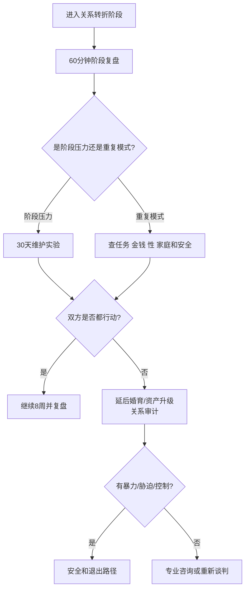

# 关系阶段复盘与婚姻长期维护

## Evidence base

Bühler 等（2021）的系统综述与元分析（DOI 10.1037/bul0000342）显示，关系满意度在生命周期中可能经历下降与回升。指南把阶段性波动与持续伤害、现实压力和核心目标冲突分开，不用“低谷正常”掩盖安全问题。

## 六个阶段检查点

在以下节点提前安排 60 分钟复盘：确定关系、同居、结婚/购房、生育/育儿、重大疾病或失业、子女离家/退休。每次回答：

1. 过去三个月最满意和最消耗的三件事是什么？
2. 哪些问题是暂时压力，哪些已经重复 3 次以上？
3. 任务、金钱、性、家庭和情绪劳动是否仍由一方长期承担？
4. 双方是否仍认同婚育、城市、忠诚和家庭责任目标？
5. 下一个阶段最小的两个改变是什么，谁在何时完成？

## 30 天维护实验

1. 第 1 周记录冲突、亲密、睡眠、财务和家务负荷，不给对方贴人格标签。
2. 第 2 周选择一个互动改变（如每周一次无手机约会或完整责任交换）和一个现实改变（如预算、托育或父母边界）。
3. 第 3 周在真实压力场景中执行，记录是否需要一方持续提醒。
4. 第 4 周复盘满意度、冲突强度、任务完成和安全感；有效措施继续 8 周，无效措施改方案或寻求专业帮助。

可直接使用的话术：

> “低谷可能和阶段压力有关，但我们不靠‘大家都这样’跳过核验。接下来 30 天做两个具体改变，再看关系是否真的改善。”

> “我不要求每天都很浪漫，但需要长期尊重、共同承担和遇到压力时能修复。我们今天只决定下一个月的动作。”

## 反应分支

| 对方反应 | 回应 | 下一步 |
|---|---|---|
| “婚后满意度下降很正常，忍忍就好。” | “阶段波动可以理解，持续羞辱、控制或单方承担不能被正常化。” | 区分阶段压力和停止条件 |
| “我们只是最近太忙。” | “那就把忙的来源、持续时间和责任写出来。” | 30 天实验，观察是否改善 |
| 一方愿意改变，另一方拒绝 | “关系维护不能长期由一方单独完成。” | 延后婚育升级，进入关系审计 |
| 阶段低谷伴随生育/失业/疾病 | “先处理资源和照护，再讨论谁对谁错。” | 调整分工，寻求外部支持 |
| 低满意度持续且出现背叛或控制 | “这不是普通阶段波动。” | 安全、事实核验和退出路径 |

## Stop conditions

- 以“婚后都这样”“有孩子就会好”掩盖暴力、胁迫、背叛或经济控制；
- 核心婚育、忠诚、城市和债务目标长期无法调和；
- 一方连续承担全部修复、家务、照护或情绪劳动，另一方拒绝任何行动；
- 反复 30 天实验仍无可验证改变，却要求结婚、购房或生育；
- 出现威胁、跟踪、性胁迫或无法安全退出。

触发停止条件时，停止增加绑定，优先安全评估、外部支持和关系退出审计。

## Mermaid 分流图

