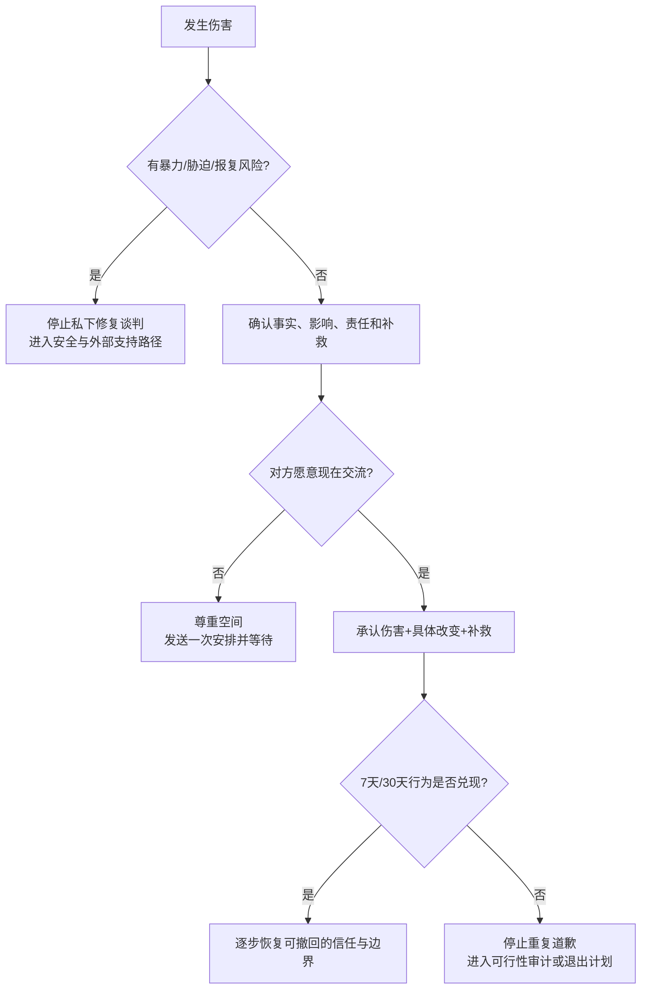

# Repair after a relationship harm

## Evidence base

McCullough et al. (2014), DOI 10.1073/pnas.1405072111, reported that conciliatory gestures such as apologies and compensation were associated with faster forgiveness and less reactive anger in 337 people who had recently been harmed. Because this package has only verified the abstract, use the finding as a repair design principle, not as a promise of reconciliation.

## First classify the incident

Pause the repair conversation and use the safety path if there is violence, threats, stalking, sexual or reproductive coercion, financial control, retaliation for setting a boundary, or a repeated pattern with no meaningful change. Do not ask the harmed person to meet privately if doing so may increase danger.

If the incident is a one-time or bounded harm without immediate danger, identify four facts before speaking:

1. What exactly happened, using observable behavior rather than a character label?
2. What impact did it have on the other person?
3. What part is fully within the responsible person's control?
4. What concrete change would make recurrence less likely?

## A usable repair sequence

1. **Open with permission:** “我想为刚才的___负责。你现在愿意听我说两分钟吗？如果不愿意，我会在___时间再问一次。”
2. **Name the act and impact:** “我在___时做了___，这让你___。我不把责任推给你的语气、压力或反应。”
3. **State the repair:** “从今天起我会___。如果我再次出现___，我会先___，并在___前告诉你结果。”
4. **Offer restitution where appropriate:** replace the damaged item, correct the misinformation, return money, redo the task, or give the other person control over timing and access. Do not use gifts to purchase silence.
5. **Ask what would help now:** “你需要我现在听完、给空间、完成一件补救，还是约一个具体时间复盘？”
6. **Track behavior over time:** agree on one observable check within 7 days and another within 30 days. Trust is updated from repeated behavior, not from the intensity of one conversation.

## Reaction branches

| 对方反应 | 当下回答 | 下一步 |
|---|---|---|
| “我现在不想听” | “我尊重你。今天___点前我只发一条事实和补救安排，是否可以由你决定。” | 不连发消息，不逼迫即时原谅 |
| “你只是因为怕失去我才道歉” | “你可以先看行动。我会在___前完成___，你不用现在相信我。” | 用可验证行动替代辩解 |
| 对方指出你遗漏的事实 | “我先记下来。请你说完，我不在现在争辩动机。” | 复述遗漏内容，再修订补救方案 |
| 对方愿意继续谈 | “我们先只处理这件事，目标是事实、影响和下一步。” | 约定时长，超时暂停并按时回来 |
| 对方要求立刻恢复亲密、性或信任 | “我愿意修复，但亲密和信任不能用承诺强行恢复。我们按行动和你的节奏来。” | 保留可撤回边界 |
| 这是反复发生的同一伤害 | “单次道歉不能解决重复模式。我们需要明确后果和外部支持。” | 进入关系可行性审计或安全路径 |

## 停止条件 / Stop conditions

- 道歉被用来要求对方立刻原谅、复合、发生性行为、借钱或放弃边界；
- 责任人继续否认可观察事实、反咬受伤者，或以礼物替代改变；
- 约定的改变在短期内重复失败，且没有新的可验证措施；
- 对方因拒绝修复而遭到威胁、跟踪、羞辱或报复；
- 任何即时人身或住房、财务、身份安全风险。

## 简易流程图

