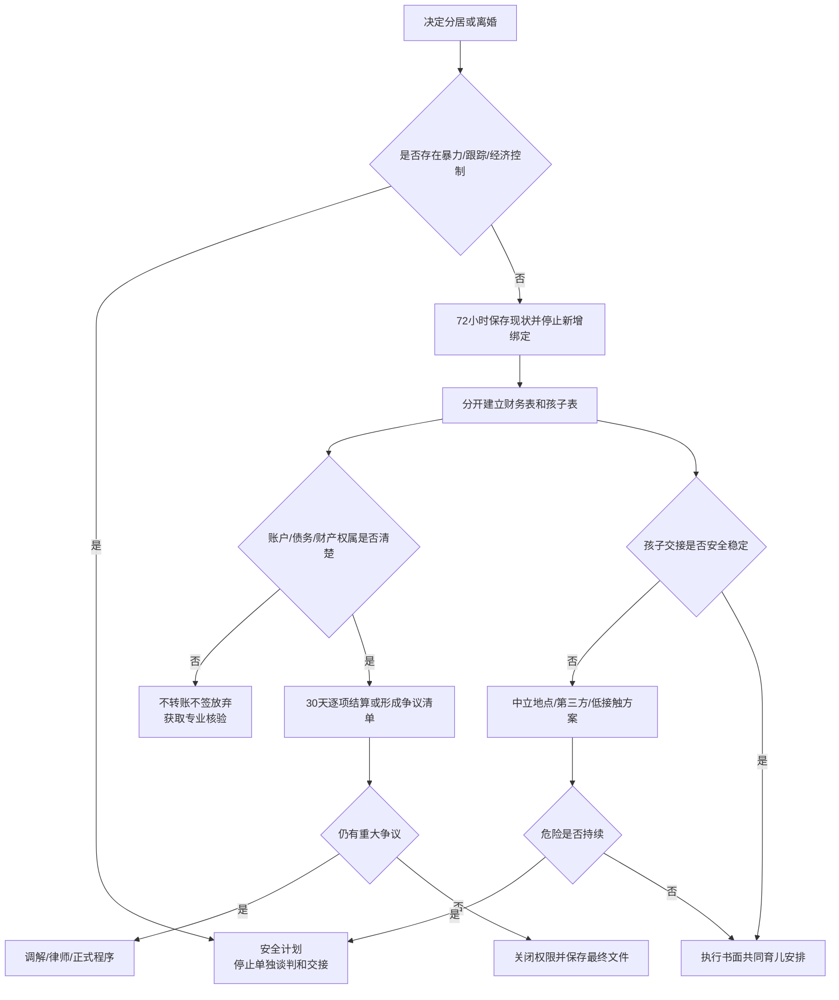

# 分居/离婚后的财务切割与共同育儿

分开关系、切割财务和继续养育孩子是三项不同任务。不要用财产让步换探视，也不要用孩子逼迫复合。先确保安全并冻结新增风险，再用书面清单处理账户、债务、住房和物品；孩子的生活安排单独制定。

## Evidence base

共同育儿质量与婚姻满意度存在群体层面的关联，但关系结束后，伴侣冲突与父母协作仍需分别处理（Ronaghan et al., 2024，DOI 10.1037/fam0001149）。分手可能伴随明显压力反应（Verhallen et al., 2019，DOI 10.1371/journal.pone.0217320）；财务隐瞒会增加共享风险（Garbinsky et al., 2020，DOI 10.1093/jcr/ucz052）。这些研究支持分轨处理、记录事实和减少冲突暴露，不能决定具体财产、监护或抚养结论。

## 先做安全分流

若存在暴力、跟踪、威胁、自伤威胁、强迫性行为、扣押证件、经济控制或危险接送，不进行私下“最后谈一次”。优先联系可信支持者、当地紧急服务、家暴支持或律师；在安全设备上保存材料，交接地点和沟通渠道由安全计划决定。

没有紧迫安全风险时，按下面的 72 小时和 30 天流程执行。

## 前 72 小时：停止新增共同风险

1. **保存现状**：下载本人依法可访问的账户流水、贷款、信用、保险、税务、房屋、车辆、合同和重要聊天；保存完整上下文，不篡改或非法进入他人账户。
2. **保护个人入口**：更换个人邮箱、云盘、支付和设备密码，启用双重验证；共同账户的处置先核对合同和当地法律，不擅自清空。
3. **停止新绑定**：不新增共同借款、担保、转账、续租、购房、投资或大额消费。
4. **列紧急需求**：未来 30 天住房、食物、医疗、通勤、孩子照护和律师费用；保留个人可支配的基本生活资金。
5. **确定单一沟通渠道**：财务和孩子事项尽量书面沟通，每条只处理一个主题；紧急事项定义为健康、安全或当天交接变化。
6. **通知必要机构**：根据合同与专业意见处理银行、保险、学校、房东、物业或雇主紧急联系人，避免擅自作出影响另一方权利的变更。

## 30 天财务切割清单

### 第 1—7 天：做完整资产负债表

分别列出：个人账户、共同账户、现金、房产、车辆、投资、保险、商业权益、押金、贵重物品、信用卡、网贷、房贷、税费、亲友借款和担保。每项记录所有人、使用人、余额、合同、还款日和证据位置。

任何“我不知道余额”的项目标为未核验，不在压力下签放弃、过户或债务确认文件。

### 第 8—14 天：保障基本运转

- 确定临时住房、房租/房贷、水电和孩子日常费用如何支付；
- 共同账户仅保留双方书面同意的必要支出，设置金额和截止日期；
- 取消不再使用且双方同意的自动扣款；不能取消的项目标明责任人；
- 个人应急金和日常账户与共同结算账户分开；
- 涉及共有财产、共同债务或争议资金时，先获取当地法律意见。

### 第 15—21 天：逐项提出处理方案

每项只提出可执行选项：出售并结算、由一方买断、暂时共同持有并限期复核、归还原所有人、或交专业程序处理。写明估值方式、付款日期、税费、违约后果和签署条件。物品交接列清单并由中立地点或第三方协助。

### 第 22—30 天：核验和收口

核对账户权限、自动扣款、保险受益安排、证件、钥匙、设备、订阅、通信地址和紧急联系人。未解决事项建立争议清单，交调解、律师或法院程序，不靠反复私聊解决。

## 共同育儿单独建表

孩子计划至少包括：

| 项目 | 需要明确 |
|---|---|
| 日常时间 | 上学日、周末、假期、生日和节日安排 |
| 交接 | 时间、地点、接送人、迟到通知和备用人 |
| 医疗 | 常用药、医生、保险、紧急授权和费用处理 |
| 教育 | 学校联系、作业、活动、家长会和设备权限 |
| 费用 | 日常、医疗、教育和临时大额支出的审批及凭证 |
| 沟通 | 单一书面渠道、响应时限、紧急事项定义 |
| 新伴侣 | 介绍节奏、过夜、纪律权限和信息边界 |
| 冲突 | 不让孩子传话；争议进入调解或专业程序 |

向孩子只解释与其生活直接相关且适龄的信息：“我们会住在不同地方，你没有造成这件事，我们都会继续照顾你。”不让孩子审判过错、保守成人秘密或汇报另一方生活。

## 可直接使用的话术

> “我们把关系、财务和孩子分成三张清单。财产争议不通过孩子解决，孩子安排也不以复合为条件。”

> “在账户和债务核验完成前，我不新增转账、担保或签署放弃文件。必要生活支出请写明金额、用途和凭证。”

> “孩子交接固定为___时间、___地点。变化请提前___小时在书面渠道提出，紧急医疗除外。”

> “这项财产有争议，我们停止私下反复争论，转交调解、律师或正式程序。”

## 对方可能的反应及回应

| 反应 | 回应 | 下一步 |
|---|---|---|
| “先把钱给我，之后再算。” | “未经核验的大额转账会扩大争议，先列余额、性质和凭证。” | 冻结新增风险，专业核验 |
| “不给钱就不让你见孩子。” | “财务与孩子安排分开处理，我会通过书面和正式渠道解决。” | 保存原话，咨询当地专业人士 |
| “为了孩子必须复合。” | “孩子需要稳定照护和低冲突，不以复合换取父母责任。” | 建立共同育儿表 |
| 要求立即签署空白或不理解的文件 | “我不会签空白或未独立审阅的文件。” | 拍照留存，寻求法律意见 |
| 一方清空或威胁清空共同账户 | “请停止新增处置，保留流水并书面说明必要支出。” | 立即保存证据并联系银行/律师 |
| 每次交接都争吵 | “交接只处理孩子当下事项，其他内容放到书面渠道。” | 改中立地点、第三方或低接触交接 |
| 让孩子传话或打听 | “成年人直接沟通，不让孩子承担信息和冲突。” | 记录模式并调整沟通安排 |
| 威胁、自伤、暴力或跟踪 | “现在不继续谈判，我会联系支持和紧急资源。” | 安全计划，停止单独接触 |

## Stop conditions

- 暴力、跟踪、威胁、扣押证件、强迫进入住所或设备；
- 以孩子、住房、医疗、隐私或经济来源逼迫复合、转账或放弃权利；
- 清空共同账户、伪造债务、转移财产、毁坏证据或冒名借贷；
- 危险驾驶、酒后接送、拒绝必要医疗或让孩子处于现实危险；
- 要求签空白文件、隐瞒合同或阻止获得独立法律意见；
- 持续让孩子传话、站队、隐瞒或监视另一方；
- 每次交接都会升级冲突且拒绝中立地点、第三方或正式安排。

触发停止条件后，停止私下谈判和单独交接；保留证据，通过银行、学校、医疗机构、律师、调解、法院或安全支持渠道处理。具体做法必须符合当地法律和现有命令。

## Mermaid 分流图

## Evidence boundary

本指南提供信息整理和行动顺序，不判断财产归属、共同债务、监护、探视或抚养费。研究关联不能代替孩子个别需要、安全评估和当地法律。涉及共有财产、隐藏资产、跨地区孩子安排、家庭暴力或现有法院命令时，应尽早向当地合格专业人士核验。
