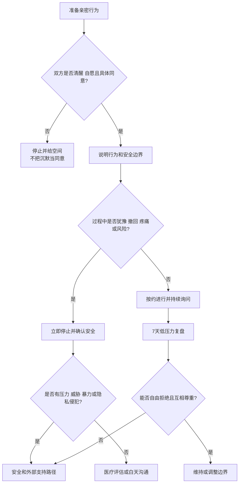

# 性同意、拒绝与亲密边界

## 明确结论

性同意必须是自愿、具体、当下、可撤回的同意。恋爱、婚姻、过去发生过性行为、送礼、同居或答应过某个行为，都不等于这一次同意。面对拒绝、犹豫、疼痛或健康风险，应立即停止相关行为，再决定是否沟通、就医或退出。

## Evidence base

Mallory、Stanton 与 Handy（2019，DOI 10.1080/00224499.2019.1568375）的元分析发现，性沟通与多项性功能指标存在关联，但不能证明沟通单独造成改善。Mallory（2022，DOI 10.1037/fam0000946）也支持把性沟通视为关系评估的一部分。研究结论不能替代当下同意，也不能为施压找理由。

## 四个当下检查

发生任何亲密行为前，双方都应能回答：

1. **是否愿意**：不是沉默、僵住、哭泣、醉酒或害怕后果下的顺从；
2. **同意什么**：接吻、触摸、口交、性交、拍摄和分享是不同事项；
3. **是否仍愿意**：任何一方都可以在过程中说停、改变方式或结束；
4. **是否安全**：疼痛、出血、感染风险、药物、避孕、怀孕和隐私风险是否已处理。

## 提出和拒绝的可执行方式

提出方：

> “你现在愿意做___吗？不愿意或中途改变都可以直接说。”

> “我们可以只停留在___，你想继续、换方式还是结束？”

拒绝方：

> “我现在不愿意。请停止，不需要我解释。”

> “我愿意拥抱，但不愿意发生性行为。这个决定今天不变。”

接受拒绝方：

> “好，我现在停下。你不需要安慰我或证明爱我。我们以后在安全、清醒时再决定是否谈。”

拒绝之后不追问、不冷脸、不砸东西、不扣钱、不威胁分手或自伤，也不把照顾对方情绪变成继续性行为的条件。

## 反应分支

| 反应 | 回应 | 下一步 |
|---|---|---|
| 对方明确同意 | “谢谢你说清楚。过程中任何时候都可以停。” | 进行约定行为并持续观察 |
| 对方犹豫、沉默或僵住 | “我们先停，不需要现在回答。” | 给空间；不把沉默当同意 |
| 对方中途撤回同意 | “好，马上停。” | 停止、确认安全，不追问理由 |
| 对方说“情侣就应该满足我” | “关系不产生性义务。你可以失望，但不能施压。” | 结束当次互动，记录是否反复 |
| 对方因拒绝而羞辱、冷暴力或威胁 | “我不会在压力下继续。等安全时再谈。” | 离开现场，联系支持者 |
| 出现疼痛、出血或健康风险 | “先停止，健康优先。” | 联系医疗或性健康服务 |
| 一方想讨论欲望差异 | “可以谈需求，但谈话不等于承诺行为。” | 白天安排 20 分钟沟通，约定一个自愿的小实验 |

## 7 天边界实验

- 第 1 天各自写三项愿意、三项不愿意和三项需要先询问的行为；
- 第 2–4 天只尝试双方明确同意的低压力亲密，不以发生性行为为目标；
- 每次结束后记录舒适度 0–10、是否能自由停止、是否出现压力；
- 第 5 天处理一个具体问题，如避孕、检测、疼痛或隐私；
- 第 7 天决定维持、调整、寻求医疗/咨询支持或结束关系；
- 任何一次胁迫、威胁或安全风险都会立即终止实验。

## Stop conditions

- 以哭闹、威胁分手、自伤、经济惩罚、曝光隐私或暴力换取性行为；
- 在对方醉酒、昏睡、意识不清、恐惧或无法自由离开时继续；
- 忽视明确说“不”、推开、僵住、疼痛或中途撤回；
- 未经同意拍摄、保存、传播或索要私密影像；
- 反复把拒绝解释成不爱，并拒绝任何安全沟通；
- 出现疼痛、出血、急性健康风险或暴力。

触发停止条件时，不继续协商性行为；先离开危险情境，保护设备和证据，并联系可信支持、医疗或当地安全服务。

## Mermaid 分流图

## Evidence boundary

性沟通研究主要是群体层面的关联，不能预测个人行为，也不能把任何性困难自动归因于沟通不足。医疗问题、创伤反应、药物影响和暴力风险需要相应专业支持；同意始终优先于关系维持。

