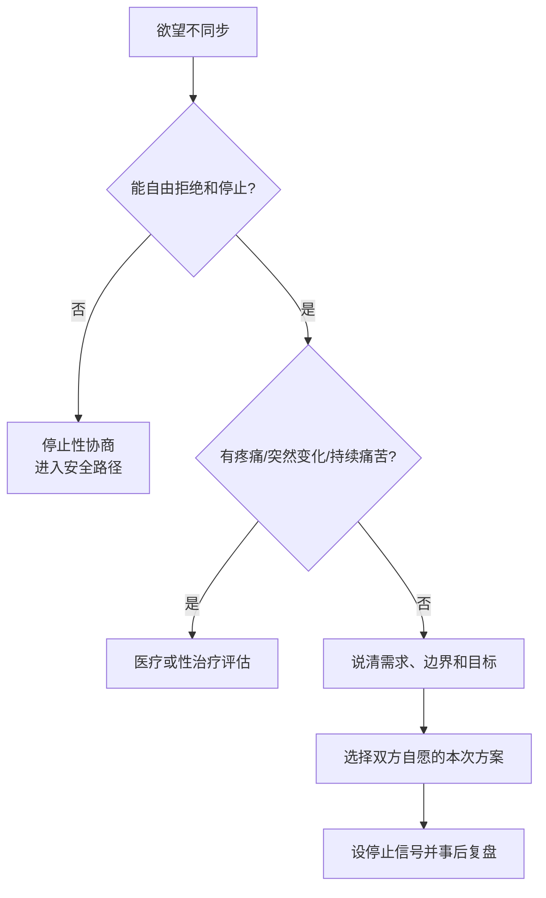

# Sexual desire discrepancy playbook

## Evidence base

Vowels & Mark (2020), DOI 10.1007/s10508-020-01640-y, analyzed 229 adults and found that communication and mutually chosen partnered strategies were associated with higher sexual and relationship satisfaction. The study is observational and does not justify pressuring a lower-desire partner or treating sex as a duty.

## Classify before negotiating

Ask privately and without blame:

1. Is the difference occasional, predictable, or persistent for at least several weeks?
2. Is either person experiencing pain, medication effects, sleep loss, depression, anxiety, hormonal change, pregnancy/postpartum change, or substance effects?
3. Can either person say “no,” pause, change the activity, or stop without anger, punishment, withdrawal of necessities, or retaliation?
4. Is the conflict about desire itself, unequal housework, unresolved hurt, body image, privacy, relationship trust, or different meanings attached to sex?

If consent is not freely revocable, stop negotiation and use the sexual-safety or coercion pathway. If there is pain, sudden major change, or persistent distress, discuss medical or sex-therapy support; do not diagnose from frequency alone.

## A 20-minute negotiation

1. Pick a neutral time when neither person is initiating sex. Set a 20-minute limit.
2. Each person states: “我现在想要的是___，我不接受的是___，我可以尝试的是___。”
3. Separate the goal from the method: closeness, pleasure, reassurance, stress relief, or sleep may need different solutions.
4. Choose one option for this occasion: postpone and schedule a check-in; non-sexual closeness; solo activity; mutually agreed non-penetrative or other sexual activity; or no activity.
5. Confirm a stop signal and a no-penalty rule: either person can stop at any moment, and stopping does not create a debt.
6. Review after the event with two questions: “这次是否让你更安全/更满足？” and “下次要保留或删除什么？”

Suggested opening:

> 我们今天的欲望不一定同步，这不自动说明谁有问题。先说清楚各自想要、不能接受和可以尝试的选项；任何方案都可以随时停止，也不以恢复性行为为目标。

## Reaction branches

| 对方反应 | 当下回答 | 下一步 |
|---|---|---|
| “你不想要我就是不爱我” | “我在回应此刻的身体和意愿，不是在给你的人下结论。我们可以先给你需要的亲密或安慰。” | 分离情感确认与性行为同意 |
| “伴侣就应该满足对方” | “伴侣可以协商，但不能把同意变成义务。我们从双方都能自由停止的选项里选。” | 取消施压，重新列选项 |
| 高欲望一方愿意等待 | “谢谢。我们约定___时间再看，不把等待记成欠账。” | 到点重新询问，不默认发生 |
| 低欲望一方愿意尝试但不确定 | “可以从非性亲密或低压力活动开始，任何时刻都能停。” | 设定停止信号，事后复盘 |
| 对方因拒绝生气、冷暴力或威胁 | “拒绝不是伤害你的许可。出现惩罚或威胁时，我会停止这次讨论并先保证安全。” | 记录模式，进入安全/关系可行性审计 |
| 持续数周且双方都痛苦 | “我们先排查健康、压力和关系问题，再决定是否寻求专业帮助。” | 约医疗或性治疗评估，不互相诊断 |

## 停止条件

- 任一方无法自由说“不”、暂停或改变活动；
- 以分手、金钱、住房、羞辱、暴力或出轨威胁换取性行为；
- 疼痛、麻木、出血或明显身体不适仍被要求继续；
- 一方反复违背停止信号，或把过去同意当作本次同意；
- 任何即时安全风险。

