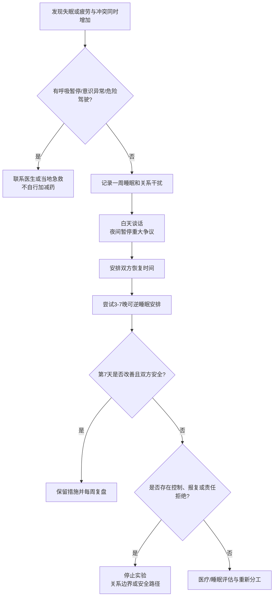

# 睡眠、疲劳与伴侣关系协作

## Evidence base

Wang 等（2025）的系统综述与元分析（DOI 10.1016/j.smrv.2024.102018）纳入 62 项研究、43,860 名参与者，发现伴侣关系质量与整体睡眠质量存在中等相关。指南使用关联证据设计一周低风险实验，不把睡眠问题或关系满意度当作个人诊断。

## 先排除需要医疗处理的信号

若出现呼吸暂停、夜间憋醒、严重打鼾伴白天嗜睡、连续多周失眠、突然异常嗜睡、危险驾驶或药物/酒精影响，优先联系医生或睡眠门诊。不要用争吵、强行叫醒或自行加减安眠药解决。

## 一周睡眠负荷记录

每天早上用 2 分钟记录：上床/起床时间、估计睡眠时长、夜醒次数、白天精力（0–10）、昨晚是否争吵、孩子/轮班/疼痛/酒精咖啡因等干扰。记录的目的，是找出可改变因素，不是监控伴侣。

## 七天协作实验

1. **白天安排谈话**：每天固定 15 分钟处理家务、育儿和明天安排，睡前 1 小时不解决重大关系争议。
2. **夜间边界**：约定 22:30 后只处理紧急安全事项；需要暂停的争议写在纸上，次日 18:00 前返回。
3. **分配恢复时间**：双方各获得至少三次 30–60 分钟不承担家务/照护的时间；按实际轮班和健康状况调整，不追求机械相等。
4. **尝试可逆安排**：连续 3–7 晚测试分床、耳塞、不同起床时间或轮流照护。每天记录睡眠和关系感受，不把安排当作惩罚。
5. **第 7 天复盘**：比较睡眠时长、白天精力、冲突次数和任务完成度；保留有效措施，停止无效或让一方更不安全的措施。

可直接使用的话术：

> “我们昨晚都只睡了 4 小时，今晚不在床上解决钱的问题。现在写下争议，明天 18:00 谈 20 分钟；今晚先按轮班安排休息。”

> “暂时分床是为了让我们恢复，不是惩罚或分手信号。我们试三晚，周日一起看睡眠和情绪有没有改善。”

## 反应分支

| 对方反应 | 回应 | 下一步 |
|---|---|---|
| “分床就是你不爱我。” | “我仍然在维护关系；今晚先保护睡眠，白天安排亲密和沟通。” | 设定结束日期和复盘时间 |
| “你累是因为你太敏感。” | “我们先看一周记录，不用标签解释。疲劳影响两个人，先处理具体干扰。” | 共同看数据和任务分配 |
| 对方夜间继续逼问、争吵或叫醒 | “现在不继续谈。明天 18:00 我会回来；如果有安全急症现在直接联系急救。” | 执行暂停；反复发生则进入边界审计 |
| 一方承担所有夜间育儿/照护 | “今晚由我负责，明晚由你负责；如果你不能承担，我们现在找备用人。” | 写清主责和备用人 |
| 记录显示疑似睡眠障碍 | “这不是靠意志力解决的，先预约医生/睡眠门诊。” | 7 天内完成预约 |

## Stop conditions

- 用不让睡觉、反复叫醒、堵门或夜间争吵作为惩罚、控制或报复；
- 一方因疲劳已经无法安全驾驶、照护儿童或工作，却被要求继续承担；
- 出现暴力、威胁、性胁迫或其他安全风险；
- 伴侣拒绝医疗评估，却要求另一方承担全部失眠、照护和情绪后果；
- 任何疑似呼吸暂停、过量用药、意识异常或急性健康危险。

触发停止条件时，先离开危险情境并联系医疗、急救或可信任的外部支持。睡眠实验不能替代安全计划或医学评估。

## Mermaid 分流图

