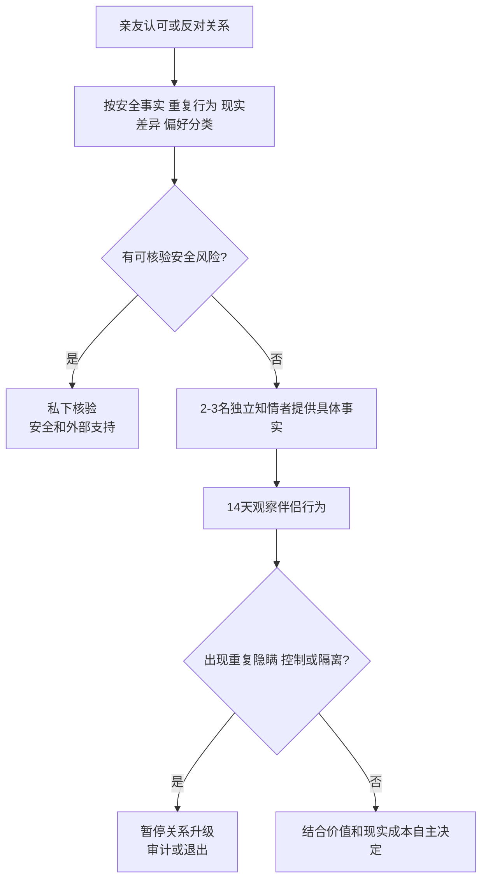

# 亲友意见、社交圈与关系决策

## Evidence base

Sprecher 与 Felmlee（2000）的纵向研究（DOI 10.1111/j.1475-6811.2000.tb00020.x）显示，伴侣对社交网络认可和干预的感知会随时间及关系转折变化。Ji、Lin、Liu 与 Kang（2024，DOI 10.1163/25895745-05020003）对上海青年及父母的访谈也提示，父母可以是尊重的顾问，但年轻伴侣仍需要保留共同决策权。指南把亲友意见当作待核验信息来源，不把认可度当作关系投票。

## 四级意见分类

收到父母或朋友反对时，逐条归类：

1. **一级：安全事实**——亲眼见到暴力、威胁、诈骗、醉驾、跟踪或强迫；立即核验并进入安全路径。
2. **二级：重复行为**——多次失约、撒谎、债务、羞辱、职业/家庭责任逃避；安排 14 天行为观察。
3. **三级：现实不匹配**——收入、城乡、学历、住房、宗教、生育和家庭责任；做现实可行性审计。
4. **四级：偏好或偏见**——外貌、籍贯、职业面子、家庭名声或刻板印象；要求提出具体后果和证据。

## 14 天外部意见核验

1. 只邀请 2–3 名相互独立、了解事实且不会从决定中获利的人提供意见。
2. 每人回答三问：具体看到了什么；发生过几次；如果继续关系，最担心的可观察后果是什么。
3. 不把评价原样转发给伴侣制造围攻；将可核验事项转成自己的问题和边界。
4. 观察 14 天：对方是否尊重社交、能否解释事实、是否用行动修复，而非要求你立即选边。
5. 最终由当事人依据安全、事实、价值和现实成本决策，并记录为什么采纳或拒绝意见。

可直接使用的话术：

> “我会认真听，但请告诉我具体事件、你亲眼看到的行为和可能后果，不要只说‘他/她不适合你’。”

> “我不会让家人替我决定，也不会为关系断掉所有朋友。我们核对事实，再由我承担决定。”

## 反应分支

| 对方反应 | 回应 | 下一步 |
|---|---|---|
| 父母说“家庭条件不配” | “请具体说明住房、债务、照护或生活方式风险；只谈面子不足以决定。” | 进入现实可行性审计 |
| 朋友说对方控制或危险 | “请给我具体事件、时间和是否有记录。” | 私下核验，不让伴侣接触举报人 |
| 伴侣要求断绝某位朋友 | “可以讨论具体越界，但不能用关系要求我失去全部支持网络。” | 设边界并观察隔离模式 |
| 亲友持续干预但没有新事实 | “我已经听取意见，之后除非有新事实，不重复讨论。” | 减少信息权限和争论 |
| 多名独立亲友指出同一行为 | “我不会按人数投票，但同一事实反复出现需要核验。” | 14 天观察或暂停关系升级 |
| 亲友基于身份歧视反对 | “身份偏见不能替代对行为和现实后果的判断。” | 拒绝偏见，保留合理边界 |

## Stop conditions

- 伴侣要求切断家人、朋友、工作、医疗或其他外部支持，以证明忠诚；
- 亲友或伴侣以住房、金钱、隐私曝光、自伤或暴力威胁逼迫选择；
- 多名独立人士提供可核验的暴力、诈骗、重大隐瞒或控制证据；
- 亲友直接骚扰、跟踪、辱骂或干预账户、住房和工作；
- 当事人无法安全表达不同意见或退出关系。

触发停止条件时，不组织集体对质；保护信息来源、证据、账户和居住安全，联系可信任的专业或法律支持。

## Mermaid 分流图

