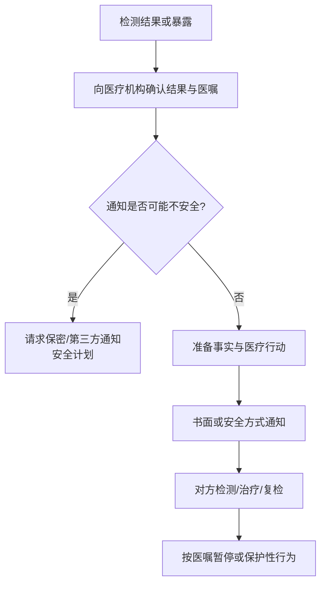

# 性传播感染结果与伴侣通知指南

## Evidence base

The Cochrane review “Strategies for partner notification for sexually transmitted infections, including HIV,” DOI 10.1002/14651858.CD002843.pub2, included 26 trials and 17,578 participants. It found no single notification strategy that works best for every STI; some enhanced or expedited approaches reduced reinfection in selected curable STI trials. This evidence card is `abstract_reviewed`, so current local clinical guidance takes priority.

## 先做医疗和安全分流

1. 先向检测机构确认：感染名称、检测可靠性、是否需要复检、治疗或避免性接触的时间，以及是否需要通知哪些类型的伴侣。
2. 在通知前评估安全：对方是否可能暴力、跟踪、曝光隐私、扣留住房或金钱，或强迫你发生性行为？
3. 如果存在风险，不要单独当面通知。请检测机构询问保密的医疗通知、第三方通知或匿名通知选项，并使用安全设备。
4. 在医学人员指导下准备事实：检测日期、医生建议、需要对方做什么检查，以及如何避免传播；不要自行诊断或承诺“肯定是谁传给谁”。

## 通知话术

安全且可以直接通知时：

> 我最近的检测结果显示需要按医生建议处理一种性传播感染。我不是在判断谁对谁错，但你可能需要尽快联系检测机构检查和治疗。在医生确认前，我们暂停性接触并按医嘱处理。我们可以通过书面方式沟通，必要时由机构协助通知。

若不确定感染已确认还是需要复检：

> 我正在等待/确认检测结果，医生建议你也咨询检测机构。现在先按医嘱采取保护措施，不把这个结果当作对关系忠诚的结论。

## 反应分支

| 对方反应 | 当下回答 | 下一步 |
|---|---|---|
| “你是在指责我出轨” | “检测结果说明需要医疗处理，不足以单独证明传播来源或时间。” | 回到检测、治疗和复检安排 |
| 愤怒并要求立刻见面 | “我会通过安全且可记录的方式沟通，必要时让机构通知。” | 不在危险地点单独见面 |
| 拒绝检测或治疗 | “你的选择由你承担，但我会按医生建议保护自己并暂停性接触。” | 告知医疗人员，遵循当地公共卫生指引 |
| 要求隐瞒或继续无保护性行为 | “我不会在风险未处理前继续。健康信息不能用威胁换取隐瞒。” | 保存沟通记录并寻求医疗/安全支持 |
| 对方担心隐私泄露 | “我们只向必要的医疗人员提供信息，不把结果发到群聊或公开平台。” | 使用保密渠道，确认通知范围 |
| 对方威胁暴力、曝光或报复 | “我停止直接沟通，后续由安全和医疗支持介入。” | 保存证据，联系可信任的人、医疗机构和当地求助服务 |

## 记录与后续

- 保存检测报告、医嘱、复检日期和通知时间，仅在安全时保存；
- 按医疗人员建议暂停性接触或使用保护措施，不以伴侣口头承诺替代治疗；
- 询问是否需要通知近期伴侣、共同检测、复检或其他公共卫生措施；
- 感染结果本身不等于出轨证据，也不能准确确定感染发生时间或来源；
- 涉及怀孕、HIV 暴露、暴露后预防、急性疼痛、出血或强迫性行为时，尽快联系当地医疗机构。

## Stop conditions

- 对方要求你隐瞒结果、销毁检测记录或继续高风险性行为；
- 通知可能触发暴力、跟踪、住房/财务控制或隐私曝光；
- 任何一方试图用检测结果强迫复合、性行为、金钱或承诺；
- 出现即时人身危险、强迫性行为或严重医疗症状。

