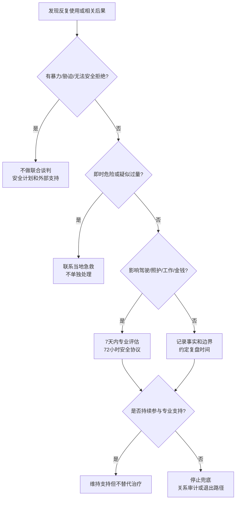

# 伴侣物质使用：边界、支持与转介

## Evidence base

Powers、Vedel 与 Emmelkamp（2008）的行为伴侣治疗元分析（DOI 10.1016/j.cpr.2008.02.002）显示，针对主动寻求酒精或药物使用障碍治疗的人，专业 BCT 在部分使用、关系和治疗保持结果上优于单独治疗。这个证据支持“连接专业治疗并协作”，不支持伴侣自行诊断或监督戒断。

## 第一步：先做安全筛查

只有在双方都能自由拒绝、单独离开和安全说“不”时，才讨论共同计划。私下询问：是否有醉酒后的威胁/暴力、堵门、摔东西、强迫性行为、抢手机或钱、开车载人、孩子照护风险。任何一项为“是”，先进入安全计划、外部支持和专业服务，不进行伴侣联合谈判。

## 第二步：区分三种问题

1. **一次性事件**：记录时间、物质、用量（若安全可得）、后果和第二天行为，不用一次事件给对方贴诊断。
2. **反复影响功能**：已经影响工作、金钱、驾驶、照护、健康或关系安全，建议在 7 天内联系医生、成瘾咨询或当地专业服务。
3. **即时危险或戒断风险**：意识不清、呼吸异常、抽搐、严重混乱、疑似过量，立即联系当地急救；长期大量使用者不要自行突然停用，戒断需由专业人员评估。

## 72 小时可执行协议

在双方清醒且安全时，把协议写成四列：

| 触发情境 | 使用者负责 | 伴侣可以做 | 明确不做 |
|---|---|---|---|
| 聚会/压力/发薪日 | 预约评估、暂不驾驶、主动报告复发 | 陪同预约、照顾一次接送 | 不替对方撒谎、借钱买物质或掩盖后果 |
| 已经使用 | 远离驾驶和孩子单独照护，联系支持人 | 保持安全距离、照顾自身和孩子 | 不在对方醉时争论、搜身或强行控制 |
| 复发后第二天 | 记录事实并完成专业联系 | 讨论下一步和边界 | 不用羞辱、威胁或无限清理残局 |

未来 72 小时只约定三件事：谁在何时联系专业服务；谁负责孩子、交通和金钱的安全安排；什么情况触发急救或暂时分开居住。每项都写截止时间。

## 可直接使用的话术

> “我不在你使用后争论你是不是‘成瘾’。我会描述事实：上周你使用后开车、第二天缺勤，孩子接送也没人负责。我的边界是你使用后不能开车或单独照护孩子；如果再次发生，我会安排孩子和我先离开，并联系专业支持。”

> “我愿意陪你预约评估，但不会替你借钱、撒谎或清理所有后果。治疗和用药决定由你和专业人员共同决定。”

## 反应分支

| 对方反应 | 回应 | 下一步 |
|---|---|---|
| “你是在控制我。” | “你可以拒绝评估，但我也可以决定我和孩子不在使用后共处或乘车。” | 把边界写成自己的行动，不争论标签 |
| “我随时能停，不需要帮助。” | “我不要求你现在承认任何诊断；我们先看过去 30 天的具体后果，再决定是否咨询。” | 记录事实，约定 7 天内复盘 |
| “你帮我隐瞒一次就好。” | “我不会撒谎或掩盖。可以帮你联系专业服务和安排安全交通。” | 停止财务和后果兜底 |
| 对方清醒后愿意求助 | “我们今天只完成一个动作：预约评估并写下 72 小时安全安排。” | 记录预约和责任人，不把承诺当完成 |
| 对方醉酒、激动或威胁 | “现在不谈关系问题。我先确保自己和孩子安全。” | 离开危险现场，联系可信任的人/急救；不单独对质 |
| 对方短期改善后反复 | “改善需要持续可验证的行动，不是一次道歉。” | 复盘治疗参与、复发计划和居住/财务边界 |

## Stop conditions

- 暴力、威胁、跟踪、性胁迫、堵门、抢夺手机/钱，或任何让人无法安全拒绝的行为；
- 醉酒或使用后驾驶、照护儿童、操作危险设备；
- 疑似过量、意识不清、呼吸异常、抽搐或严重混乱；
- 对方拒绝专业支持，却要求伴侣承担全部监督、借钱、撒谎和后果；
- 伴侣或孩子已经持续处于恐惧、失眠、财务损失或身体风险中。

触发停止条件时，不进行伴侣联合治疗或现场谈判；优先离开危险、联系当地急救/成瘾服务、可信任的人和必要的法律支持。任何戒断或药物调整由专业人员决定。

## Mermaid 分流图

