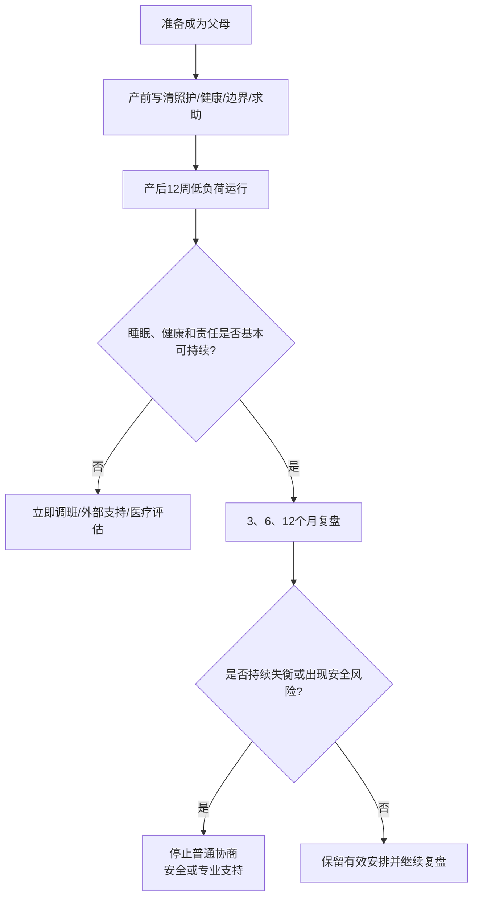

# 成为父母后的关系过渡指南

## Evidence base

Bogdan, Turliuc & Candel (2022), DOI 10.3389/fpsyg.2022.901362, meta-analyzed 49 studies and found a medium decline in marital satisfaction from pregnancy to 12 months postpartum and a smaller decline from 12 to 24 months, with cross-partner effects. This is an `abstract_reviewed` evidence card; use it to plan support and workload, not to predict a particular couple's outcome.

## 产前先写清楚四件事

1. **照护责任**：夜间照护、喂养、就医、用品、家务和谁负责发现问题、计划、执行、跟进。
2. **恢复与健康**：产后恢复、疼痛、哺乳或喂养选择、心理健康筛查、就医陪同和休息时段。
3. **家庭边界**：探访预约、留宿、育儿意见、隐私、金钱支持和谁向自己的家人传达规则。
4. **冲突与退出**：疲惫时如何暂停争论、谁可以求助、出现胁迫或暴力时如何安全离开；不要把孩子当作绑定关系的工具。

每项写成“负责人、备份、触发条件、截止时间”，不要只写“到时候再看”。

## 产后 12 周低负荷运行

1. 每天只保留三项不可省略任务：婴儿安全、产妇/照护者基本健康、必要的进食和睡眠。
2. 用轮班或明确的连续休息块分配夜间责任；不能因为一方“更会”就永久承担全部发现和规划。
3. 每周一次 20 分钟复盘，不在婴儿哭闹或深夜争论长期关系结论。
4. 复盘四项：睡眠、身体恢复、心理状态、责任闭环。先补资源和分工，再讨论浪漫和性频率。
5. 保留低压力连接：每天 10 分钟不谈任务的交流，或由一方明确提出需要陪伴、安静或具体帮助。

## 3、6、12 个月检查点

| 时间 | 必查问题 | 行动 |
|---|---|---|
| 3 个月 | 是否有人持续没有连续睡眠、疼痛未处理或独自承担全部计划？ | 立即调班、请家人/付费服务或医疗支持 |
| 6 个月 | 育儿、家务和金钱责任是否仍由一方提醒和兜底？ | 重新分配完整责任域，必要时接受伴侣或家庭咨询 |
| 12 个月 | 冲突是否能修复，双方是否仍有自主时间和基本亲密？ | 保留有效安排；持续失衡则进入关系可行性审计 |

## 反应分支

| 对方反应 | 当下回答 | 下一步 |
|---|---|---|
| “有了孩子都这样，忍一忍” | “变化常见不等于所有失衡都必须忍受。我们先处理睡眠、健康和责任分配。” | 写出一项本周可执行调整 |
| “你更会做，所以你负责” | “能力可以通过学习提升，不能自动变成永久责任。” | 转移完整责任闭环并设置复盘 |
| 产妇或照护者持续低落、绝望或无法生活 | “这不是靠意志或沟通解决的。我们现在联系专业支持。” | 尽快联系医疗/心理服务；有即时危险联系当地急救 |
| 家人未经同意介入 | “孩子和我们的隐私、照护安排由我们共同决定。” | 由各自伴侣传达边界，违反时减少接触 |
| 一方要求用性或生育补偿关系 | “疲惫、疼痛和不同意不能被当作伴侣义务。” | 暂停压力性要求，回到安全与可撤回同意 |
| 双方都已耗尽 | “今天先只解决最必要的三件事，长期问题安排在___时间谈。” | 降低当下任务量并引入外部支持 |

## Stop conditions

- 任何一方无法获得基本睡眠、医疗照护或安全离开空间；
- 出现产后抑郁或其他严重心理症状、自伤想法、婴儿安全风险或即时危险；
- 用孩子、住房、金钱或性行为胁迫另一方；
- 长期把夜间照护、心理负荷和所有家庭决策推给一方，且拒绝调整；
- 暴力、跟踪、限制就医、扣留证件或其他控制行为。

