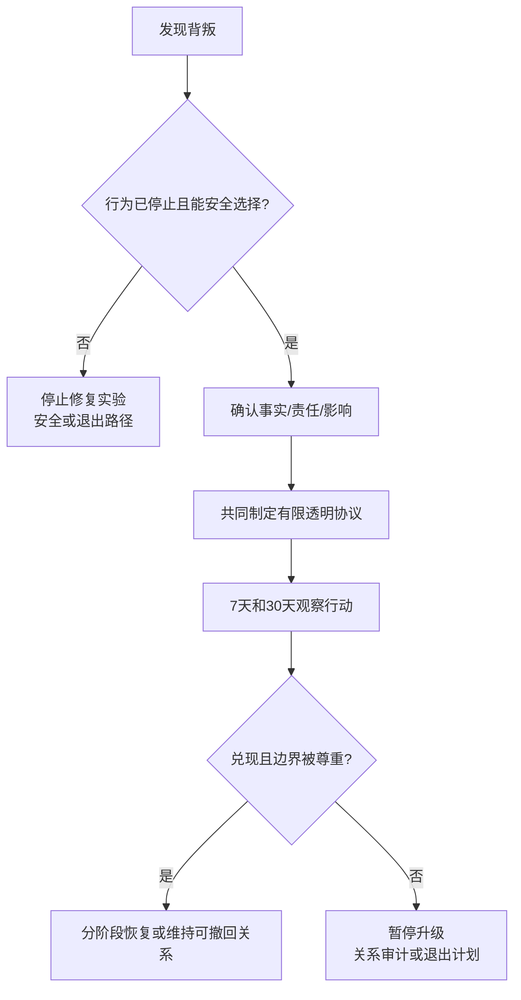

# 背叛后的信任修复指南

## Evidence base

Giacobbi & Lalot (2025), DOI 10.1111/1467-6427.12483, reviewed 13 empirical articles and identified transparency, bounded monitoring, remorse/accountability, shared activities, and clear explanation as recurring trust-repair themes. This is an `abstract_reviewed` evidence card, so use it as a structure for decisions rather than a guaranteed therapy protocol.

## 先判断是否进入修复

不要把所有失信都直接放进“沟通修复”。先私下确认：

1. 背叛是否已经停止，第三方关系、隐瞒账户或相关行为是否真正结束？
2. 责任人是否主动承认可观察事实，而不是只承认“你很难受”？
3. 是否存在暴力、胁迫、报复、跟踪、财务控制或持续欺骗？
4. 受伤方是否可以自由选择暂停、退出或不提供更多隐私？
5. 双方是否都愿意用 30 天观察行动，而不是要求当场恢复信任？

有暴力、报复、强迫交出设备或持续欺骗时，停止共同修复实验，进入安全或退出路径。

## 五步修复协议

1. **事实边界**：列出已经确认的事实、仍未知的事实和不需要追问的细节。禁止用新谎言填补空白。
2. **责任与影响**：责任人说明做了什么、造成什么影响、哪些后果由自己承担，不把原因变成借口。
3. **透明安排**：双方共同决定必要的透明项目、频率、期限和停止条件，例如相关账户、行程或第三方联系的有限核对。透明不是无限查手机。
4. **补救行动**：完成可验证的补偿、边界调整、健康检测、财务纠正或专业咨询，不用礼物购买沉默。
5. **时间复盘**：第 7 天和第 30 天分别复盘事实、兑现率、压力和边界感，再决定继续修复、暂停升级或退出。

责任人可使用：

> 我承认我在___做了___，这影响了你的___。原因可以解释背景，但不能减少我的责任。我愿意在___期限内完成___，并接受你对透明范围和节奏的选择；你不需要现在原谅我。

受伤方可使用：

> 我可以观察行动，但不会承诺继续关系。我们先写清事实、透明范围、期限和停止条件，任何时候我都可以暂停或退出。

## 反应分支

| 对方反应 | 当下回答 | 下一步 |
|---|---|---|
| “都过去了，别再问” | “时间不会自动替代事实和责任。我们只讨论约定范围内的核对。” | 继续有限核对；拒绝无限争辩 |
| 只说“我后悔”但不提供行动 | “后悔是态度，修复还需要具体行为和日期。” | 写出一项可验证补救 |
| 要求受伤方交出全部密码 | “透明范围必须双方同意、有期限、可撤回，不能变成永久监控。” | 改为低侵入、有限核对；有威胁则走安全路径 |
| 受伤方不愿继续 | “我接受你不继续的决定，不用用修复流程说服你。” | 进入住房、财务、物品和联系方式退出安排 |
| 责任人反咬“都是你逼的” | “关系问题可以以后讨论，但这不替代对这次行为负责。” | 暂停修复，记录事实并评估安全 |
| 30 天内再次隐瞒或越界 | “这不是一次失误，而是协议没有被执行。” | 停止升级承诺，进入关系可行性审计或退出 |

## Stop conditions

- 第三方关系或关键隐瞒没有停止；
- 责任人继续否认事实、篡改证据或把责任转给受伤方；
- “透明”变成强制密码、定位、隔离朋友或无限期监控；
- 受伤方因拒绝原谅、性行为、复合或继续共同生活而遭到威胁；
- 第 7 天和第 30 天都没有可观察改变，或出现新的背叛；
- 任何暴力、跟踪、报复、财务控制或即时安全风险。

