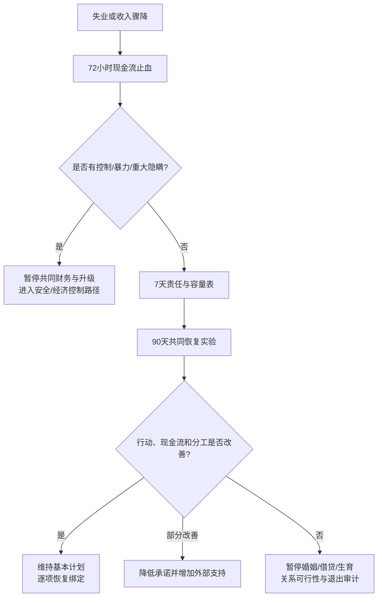

# 失业、收入冲击与伴侣共同决策审计

## 明确结论

失业或收入骤降本身不是关系失败，也不等于任何一方必须无限期承担全部后果，更不等于伴侣可以控制另一方；收入冲击不等于控制。先把三件事分开：**暂时性的外部收入冲击、恢复行动是否真实、伴侣是否借机控制或转移责任**。在现金流、债务和照护责任尚未看清时，暂停买房、结婚、生育、共同借贷和大额转账；用 90 天计划验证恢复行动与双方承受能力。

## Evidence base

- Gedikli 等（2022，DOI 10.1080/1359432X.2022.2106855）：29 项研究、46 个样本的纵向元分析显示，失业与福祉下降相关，持续时间和社会经济情境会影响程度。
- Falconier 与 Kuhn（2019，DOI 10.3389/fpsyg.2019.00571）：139 项研究的伴侣共同应对综述支持区分共同解决压力与一方独自承担。
- Falconier 等（2020，DOI 10.1037/str0000157）：经济压力与伴侣关系功能之间存在群体层面关联，不能替代对具体现金流和责任的审计。

90 天是可逆的预算和求职复盘周期，不是就业或关系恢复的保证。

## 第一步：72 小时现金流止血

- 列出未来 30 天的住房、食物、医疗、交通、孩子和最低债务支出；
- 暂停非必要大额消费、共同投资、婚礼订金、买房和新增借贷；
- 保留双方各自可支配的最低生活资金，不能以“共同面对”为名没收一方账户；
- 明确谁在何时支付哪些必要账单，写下证据，不靠口头记忆；
- 如果出现断供、失去住处、医疗中断或暴力风险，先联系当地社会、法律或紧急支持。

## 第二步：7 天责任与容量表

双方分别填写，再一起核对：

| 项目 | 要写清 |
|---|---|
| 现有资源 | 现金、收入、保险、失业/社保资格、可借助的家人支持 |
| 固定义务 | 房租/房贷、债务、赡养、孩子、医疗、交通 |
| 恢复行动 | 每周申请/联系次数、技能更新、面试、临时收入和截止日 |
| 家庭分工 | 谁负责求职期间的家务、照护、手续和情绪支持 |
| 最低线 | 何时动用应急金、搬迁、减少开支、寻求专业援助 |
| 决策暂停 | 哪些婚姻、住房、生育或借贷决定在现金流稳定前不做 |

“我会努力找工作”不是计划；必须有频率、负责人、截止日和备用方案。

## 第三步：90 天共同恢复实验

每周一次 30 分钟复盘，固定四项：

1. 本周实际现金流和剩余应急月数；
2. 恢复行动完成数与阻碍；
3. 家务、照护和情绪劳动是否被一方永久兜底；
4. 下周最多三项行动和一个备用方案。

双方可以重新分工，但必须写明临时性质和复盘日期。收入较高的一方可以多承担共同支出，但不能因此自动取得对另一方手机、社交、医疗、职业和生育的决定权。

## 不同情况的决策

- **短期失业、行动稳定**：维持基本关系计划，但暂停不可退的大额绑定；每 30 天复盘一次。
- **持续失业、行动充分但现金流紧张**：先降低住房和消费承诺，增加外部支持，不把经济困难解释成道德失败。
- **拒绝求职或隐瞒债务**：从“外部冲击”转为责任和透明问题，暂停共同借贷及婚育升级。
- **一方借收入差距控制另一方**：从财务协商转为权力和安全审计。
- **双方都失去收入**：先建立最低生存预算和外部支持，暂缓关系去留的情绪性结论。

## 可直接使用的话术

> “失业是现实冲击，不是人格判决。我们先把未来 30 天必要支出、求职行动和双方责任写清，再决定哪些计划暂停。”

> “我可以在 90 天内承担这三项共同支出，但不会交出账户、手机或职业决定权。每周按记录复盘。”

> “在应急金、债务和收入安排没有稳定前，我不买房、不共同借贷、不支付不可退婚礼款，也不把怀孕当成解决经济压力的方法。”

## 对方可能反应及回答

| 反应 | 回应 | 下一步 |
|---|---|---|
| “你不支持我。” | “支持包括共同做计划和求助，不等于无限兜底或取消边界。” | 写三项具体支持 |
| “我很快就会找到，别问细节。” | “我不要求保证结果，只需要行动频率、现金流和下次复盘日期。” | 设 7 天行动表 |
| “既然我收入高，钱和决定都归我。” | “收入影响分担比例，不自动授予控制对方生活的权力。” | 分开账户与共同预算 |
| “先借钱买房/结婚，工作后再还。” | “收入不确定时新增不可逆债务会放大风险。” | 暂停借贷和大额付款 |
| “你应该辞职/搬家来配合我。” | “职业迁移是双方共同决定，不能单方面转嫁。” | 比较两套可行预算 |
| 一方长期承担全部家务和安抚 | “这是责任转移，不是临时支持。我们要写清谁负责和何时复盘。” | 调整分工，必要时寻求外部照护 |
| 对方隐瞒债务、拒绝任何记录 | “问题已经不是暂时失业，而是共同风险透明度。” | 暂停共同财务和婚姻升级 |
| 对方因经济困难羞辱、威胁或限制你 | “经济压力不能成为控制和报复的理由。” | 进入安全与经济控制审计 |

## Stop conditions

- 以失业、收入或住房为理由没收账户、证件、手机、社交和医疗决定权；
- 隐瞒债务、赌博、担保、失信或要求你先共同借贷；
- 用经济依赖逼迫结婚、怀孕、辞职、搬迁或放弃工作；
- 连续多个复盘周期只有口头承诺，没有行动、资料或备用方案；
- 失业期间出现暴力、威胁、危险性行为、成瘾或孩子照护不安全；
- 应急金接近耗尽却拒绝降低承诺、寻求外部援助或讨论分开财务；
- 你因长期兜底已无法睡眠、工作、照护自己，却被要求继续独自承担。

## Mermaid 分流图

## Evidence boundary

失业—福祉研究主要关注个人心理和就业结果，不是婚姻因果研究；指南不预测关系是否会因失业而结束，也不把求职速度当作人格价值。90 天实验只用于看现金流、责任和支持是否变得可持续；医疗、劳动、债务和社会保障问题应按所在地规则咨询专业机构。

