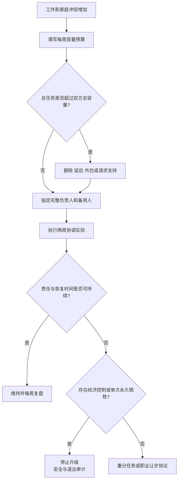

# 工作—家庭冲突与伴侣协作

## Evidence base

Fellows、Chiu、Hill 与 Hawkins（2016）的元分析（DOI 10.1007/s10834-015-9450-7）汇总 33 项研究、49 个样本，发现工作—家庭冲突与伴侣关系质量存在稳定负向关联。指南把冲突转换为容量、责任和职业选择的具体审计。

## 每周容量预算

双方每周日晚分别填写未来七天：

| 项目 | 需要记录 |
|---|---|
| 有偿工作 | 工时、通勤、加班、待命、出差和恢复时间 |
| 家庭执行 | 做饭、清洁、接送、采购、医疗和行政事务 |
| 心理负荷 | 谁发现、安排、提醒、跟进和承担失败后果 |
| 照护 | 儿童、老人、宠物、疾病和夜间责任 |
| 个人恢复 | 睡眠、运动、朋友、独处和个人就医 |

先确定双方可用容量，再分任务；工资高低不能自动决定家务和决定权。

## 两周协调实验

1. 第 1 天列出不可移动工作、可调整工作和家庭硬任务。
2. 给每项家庭任务指定完整负责人和备用人，写明截止时间。
3. 约定加班通知门槛，例如超过 19:00 必须在 16:00 前告知并启动备用方案。
4. 双方各保留每周至少一次 60 分钟恢复时间；若容量不足，删减任务或购买/请求外部支持。
5. 第 7、14 天复盘缺口：谁经常临时兜底、谁的职业受损、谁没有恢复时间，以及哪些承诺未兑现。

## 职业让步规则

若一方为迁移、生育、育儿或照护减少工作，协议必须写明：开始和结束日期、收入损失、养老金/保险影响、个人应急金、另一方承担的完整责任、重返工作的条件。没有恢复路径的“临时牺牲”按长期安排评估。

可直接使用的话术：

> “我们先按时间和精力算容量，不按谁工资高决定谁有豁免权。你这周加班，我可以接手接送，但下周你完整负责采购和周末照护。”

> “如果我要为家庭暂停工作，需要写清期限、个人应急金和重返工作的计划，不能只靠口头承诺。”

## 反应分支

| 对方反应 | 回应 | 下一步 |
|---|---|---|
| “我赚钱多，所以家里你负责。” | “收入贡献需要承认，但家务、照护和恢复也占容量。我们把所有时间和责任放进同一张表。” | 完成每周容量预算 |
| “临时加班，没办法通知。” | “偶发可以，反复发生就需要备用人和任务重分。” | 记录两周频率和后果 |
| “你工作没我重要。” | “职业价值不由收入单独决定。任何长期让步都要有期限和补偿。” | 启动职业让步协议 |
| 双方都满负荷 | “这不是谁更努力的问题，当前总任务超过总容量。” | 删除、延后、外包或请求支持 |
| 一方总在临时兜底 | “备用方案不能长期等于同一个人牺牲。” | 调整主责或减少任务 |
| 对方阻止工作或没收收入 | “这不是分工问题，是经济控制。” | 保护账户、证件和外部支持 |

## Stop conditions

- 以收入、职位或性别为由让一方永久承担全部家务、育儿和心理负荷；
- 要求一方辞职、迁移或放弃职业，却拒绝期限、补偿、个人应急金和恢复路径；
- 扣留工资、限制工作、破坏求职或用经济依赖阻止退出；
- 两周实验中反复失约，并把所有临时后果转嫁给同一方；
- 出现威胁、暴力、跟踪、性胁迫或无法安全拒绝。

触发停止条件时，暂停职业牺牲、迁移、婚育和共同负债，优先账户、证件、住房和安全支持。

## Mermaid 分流图

